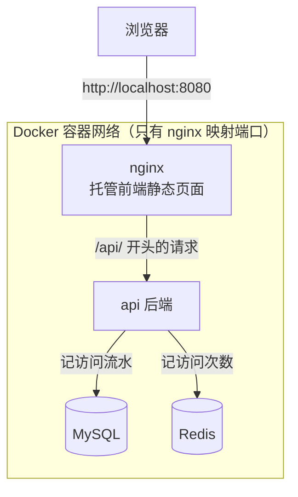

# 04 Compose 全栈实战

前面两章学完了配置和命令，这一章来一次综合练习：**用一个 `compose.yaml` 把 MySQL + Redis + 后端 API + 前端页面 + Nginx 五个服务一起编排起来**，在本机完整跑通。

所有代码都在本篇里给全了，照着敲就能跑。我们采用「先跑数据层 → 再加后端 → 最后加前端」的顺序，每一步都验证通过再进行下一步——这也是实际编排多服务项目的正确姿势，一把梭全写完再排错会痛苦得多。

> 本篇是**本地练习版**，目标是把编排的过程练熟；生产环境的完整版（密钥管理、健康检查、日志限额、上线运维）见 [全栈项目部署](../03-部署实战/05-全栈项目部署.md)。

## 1. 目标架构



- 前端页面上有一个按钮，点击后请求 `/api/visit`
- 后端把访问次数记在 Redis 里，把访问记录写进 MySQL
- 五个服务只有 nginx 暴露端口，服务之间全部用**服务名**互相访问

## 2. 建好项目骨架

```bash
mkdir -p fullstack-demo/{backend,frontend,nginx,mysql/init}
cd fullstack-demo
```

最终的目录结构：

```text
fullstack-demo/
├── backend/
│   ├── main.py
│   ├── requirements.txt
│   └── Dockerfile
├── frontend/
│   └── index.html
├── nginx/
│   └── default.conf
├── mysql/
│   └── init/
│       └── 01-schema.sql
└── compose.yaml
```

## 3. 第一步：先把 MySQL 和 Redis 跑起来

数据层没有依赖，最先启动。先写初始化脚本：

```sql title="mysql/init/01-schema.sql"
CREATE TABLE IF NOT EXISTS visit_log (
    id BIGINT AUTO_INCREMENT PRIMARY KEY,
    visited_at DATETIME DEFAULT CURRENT_TIMESTAMP
);
```

`compose.yaml` 第一版，只有两个服务：

```yaml title="compose.yaml"
services:
  mysql:
    image: mysql:8.0
    environment:
      MYSQL_ROOT_PASSWORD: root123
      MYSQL_DATABASE: demo
      TZ: Asia/Shanghai
    volumes:
      - mysql-data:/var/lib/mysql
      - ./mysql/init:/docker-entrypoint-initdb.d:ro
    healthcheck:
      test: ["CMD", "mysqladmin", "ping", "-h", "localhost"]
      interval: 5s
      timeout: 3s
      retries: 10
      start_period: 30s

  redis:
    image: redis:7-alpine
    healthcheck:
      test: ["CMD", "redis-cli", "ping"]
      interval: 5s
      timeout: 3s
      retries: 10

volumes:
  mysql-data:
```

起服务并验证：

```bash
docker compose up -d
docker compose ps        # 等两个服务都变成 Up (healthy)

# 验证 MySQL：建表脚本生效了吗
docker compose exec mysql mysql -uroot -proot123 -e "SHOW TABLES FROM demo;"
# 验证 Redis
docker compose exec redis redis-cli ping     # PONG
```

> 练习环境图省事直接写了明文密码。真实项目请用 `.env` 文件注入，写法见 [Compose 配置详解](02-Compose配置详解.md)。

## 4. 第二步：加入后端 API

一个精简的 FastAPI 应用，同时用到 MySQL 和 Redis：

```python title="backend/main.py"
import os

import pymysql
import redis
from fastapi import FastAPI

app = FastAPI()

# 注意：主机名是服务名 mysql / redis，不是 localhost！
r = redis.Redis(host="redis", port=6379, decode_responses=True)


def get_db():
    return pymysql.connect(
        host="mysql",
        user="root",
        password=os.environ["MYSQL_ROOT_PASSWORD"],
        database="demo",
    )


@app.get("/health")
def health():
    return {"status": "ok"}


@app.get("/visit")
def visit():
    # Redis 记总次数，MySQL 记流水
    count = r.incr("visit_count")
    db = get_db()
    with db:
        with db.cursor() as cur:
            cur.execute("INSERT INTO visit_log () VALUES ()")
        db.commit()
    return {"visit_count": count}
```

```text title="backend/requirements.txt"
fastapi
uvicorn[standard]
pymysql
redis
cryptography
```

```dockerfile title="backend/Dockerfile"
FROM python:3.12-slim
WORKDIR /app
COPY requirements.txt .
RUN pip install --no-cache-dir -r requirements.txt -i https://pypi.tuna.tsinghua.edu.cn/simple
COPY . .
CMD ["uvicorn", "main:app", "--host", "0.0.0.0", "--port", "8000"]
```

在 `compose.yaml` 的 `services:` 下追加 api 服务：

```yaml
  api:
    build: ./backend
    environment:
      MYSQL_ROOT_PASSWORD: root123
    depends_on:
      mysql:
        condition: service_healthy    # 等 MySQL 真正就绪才启动
      redis:
        condition: service_healthy
```

重新拉起并验证（api 还没暴露端口，借 `exec` 在容器网络里测）：

```bash
docker compose up -d --build
docker compose exec api python -c "import urllib.request; print(urllib.request.urlopen('http://localhost:8000/visit').read())"
# b'{"visit_count":1}'  多跑几次数字会增长
```

## 5. 第三步：加入前端和 Nginx

前端就一个页面，点按钮调接口：

```html title="frontend/index.html"
<!DOCTYPE html>
<html lang="zh">
<head>
  <meta charset="UTF-8" />
  <title>Compose 全栈实战</title>
</head>
<body>
  <h1>Compose 全栈实战</h1>
  <button onclick="visit()">访问一次</button>
  <p id="result">还没点过</p>
  <script>
    async function visit() {
      const res = await fetch('/api/visit');
      const data = await res.json();
      document.getElementById('result').textContent =
        `这是第 ${data.visit_count} 次访问`;
    }
  </script>
</body>
</html>
```

Nginx 负责两件事：托管前端静态文件、把 `/api/` 转发给后端：

```nginx title="nginx/default.conf"
server {
    listen 80;

    root /usr/share/nginx/html;
    index index.html;

    location /api/ {
        proxy_pass http://api:8000/;   # 结尾的 / 会去掉 /api 前缀
        proxy_set_header Host $host;
        proxy_set_header X-Real-IP $remote_addr;
    }

    location / {
        try_files $uri $uri/ /index.html;
    }
}
```

`compose.yaml` 再追加 nginx 服务（练习版前端不用构建，直接把 html 挂载进去）：

```yaml
  nginx:
    image: nginx:1.25-alpine
    ports:
      - "8080:80"                     # 整个项目唯一对外的端口
    volumes:
      - ./frontend:/usr/share/nginx/html:ro
      - ./nginx/default.conf:/etc/nginx/conf.d/default.conf:ro
    depends_on:
      - api
```

## 6. 一键起停与整体验证

```bash
docker compose up -d --build
docker compose ps          # 四个服务：nginx / api / mysql / redis

curl http://localhost:8080/            # 返回 index.html
curl http://localhost:8080/api/health  # {"status":"ok"}
```

浏览器打开 `http://localhost:8080`，点几次按钮，数字持续增长。再验证数据确实落库了：

```bash
docker compose exec mysql mysql -uroot -proot123 -e "SELECT COUNT(*) FROM demo.visit_log;"
docker compose exec redis redis-cli get visit_count
```

两个数字一致，说明整条链路「前端 → nginx → api → mysql/redis」全部打通。收工：

```bash
docker compose down        # 停止并删除容器（数据卷保留）
docker compose down -v     # 连数据一起删，练习完清场用
```

## 7. 这个练习里最常踩的坑

**后端连不上数据库：`Can't connect to MySQL server on 'localhost'`？**
容器里的 `localhost` 是容器自己。主机名必须写服务名 `mysql`、`redis`。

**api 起来就崩：`Connection refused`？**
MySQL 容器 Up 了但还在初始化。检查 `depends_on` 是否写了 `condition: service_healthy`，以及 mysql 服务有没有配 `healthcheck`——只写 `depends_on: [mysql]` 只等启动、不等就绪。

**改了 `main.py` 刷新页面没变化？**
自建镜像的代码是烙进镜像里的，改完必须 `docker compose up -d --build` 重新构建。

**点按钮报 404？**
检查 nginx 配置里 `proxy_pass http://api:8000/;` 结尾的 `/`：带 `/` 转发时会去掉 `/api` 前缀，正好对上后端的 `/visit` 路由；如果后端路由本身带 `/api` 前缀，则要去掉结尾的 `/`。

**8080 端口被占了？**
把 `ports` 改成别的，比如 `"8081:80"`，容器内的 80 不用动。同理服务间互访也不受影响——容器互访走的是内部端口，跟 `ports` 映射成多少无关，原理见 [数据卷与网络](../01-Docker基础/05-数据卷与网络.md) 的「该连哪个端口」一节。

## 小结

- 多服务编排的正确节奏：**数据层 → 后端 → 前端/网关**，每加一层验证一层
- 服务间互访一律用服务名，`localhost` 在容器里指容器自己
- `depends_on` + `condition: service_healthy` 才能做到「等就绪」而不是「等启动」
- 只有 nginx 暴露端口，其余服务藏在容器网络里，这是最基本的安全姿势

练熟这套流程后，接下来进入部署实战章节，把学到的东西逐个用在真实项目上：[01-部署静态网站](../03-部署实战/01-部署静态网站.md)。本篇的生产版本（密钥管理、健康检查、日志限额、备份运维一应俱全）在该章压轴：[全栈项目部署](../03-部署实战/05-全栈项目部署.md)
