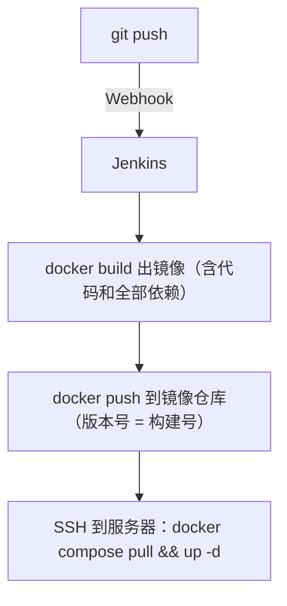

# 05 实战：部署 Python 项目

后端项目和前端不同：产物不是静态文件，而是**要一直跑着的服务进程**，部署时必须让新代码替换旧进程。本篇以 FastAPI 项目为例，走**Docker 镜像**部署路线——Jenkins 构建镜像推到镜像仓库，服务器拉镜像重启容器。

## 1. 为什么后端推荐走镜像？

前一章前端是「传文件」，后端如果也传文件（拉代码到服务器再 pip install），会遇到：

- 服务器上要装 Python、装依赖，版本漂移没人管
- 依赖装一半失败，服务就起不来了
- 回滚困难：旧代码还得再拉一遍

镜像方案把「代码 + 依赖 + 运行时」冻结成一个不可变的包：



回滚 = 把版本号改回去重新 up，秒级完成。

## 2. 前置条件

- Jenkins 容器已挂载 `docker.sock`（见 [02-安装Jenkins](02-安装Jenkins.md)，这样才能执行 docker build）
- 一个镜像仓库。示例用阿里云个人版容器镜像服务（ACR，免费），也可以是 Harbor / Docker Hub
- 项目里已有 `Dockerfile`（写法见 [部署FastAPI应用](../03-部署实战/02-部署FastAPI应用.md)）
- Jenkins 凭据：
  - `deploy-server`：服务器 SSH 私钥
  - `acr-cred`：镜像仓库的用户名密码（Kind 选 Username with password）

## 3. 编写 Jenkinsfile

```groovy title="Jenkinsfile"
pipeline {
    agent any    // 直接在 Jenkins 所在机器跑（要用宿主机的 docker）

    options {
        timeout(time: 20, unit: 'MINUTES')
        disableConcurrentBuilds()
        buildDiscarder(logRotator(numToKeepStr: '20'))
    }

    triggers {
        githubPush()
    }

    environment {
        REGISTRY   = 'registry.cn-hangzhou.aliyuncs.com'   // 镜像仓库地址
        IMAGE      = "${REGISTRY}/myns/fastapi-app"        // 镜像完整名
        TAG        = "build-${BUILD_NUMBER}"               // 版本号用构建号，可追溯
        SERVER     = 'root@192.168.1.100'
        DEPLOY_DIR = '/opt/fastapi-app'                    // 服务器上放 compose.yaml 的目录
    }

    stages {
        stage('拉取代码') {
            steps { checkout scm }
        }

        stage('构建镜像') {
            steps {
                sh 'docker build -t $IMAGE:$TAG -t $IMAGE:latest .'
            }
        }

        stage('推送镜像') {
            steps {
                // 凭据注入成 REG_USER / REG_PSW 两个环境变量
                withCredentials([usernamePassword(
                    credentialsId: 'acr-cred',
                    usernameVariable: 'REG_USER',
                    passwordVariable: 'REG_PSW'
                )]) {
                    sh '''
                        echo $REG_PSW | docker login $REGISTRY -u $REG_USER --password-stdin
                        docker push $IMAGE:$TAG
                        docker push $IMAGE:latest
                    '''
                }
            }
        }

        stage('部署') {
            when { branch 'master' }
            steps {
                sshagent(['deploy-server']) {
                    sh '''
                        ssh -o StrictHostKeyChecking=no $SERVER "
                            cd $DEPLOY_DIR &&
                            docker compose pull &&
                            docker compose up -d &&
                            docker image prune -f
                        "
                    '''
                }
            }
        }
    }

    post {
        success { echo "部署完成，版本：$TAG" }
        failure { echo '构建失败！' }
        always {
            sh 'docker rmi $IMAGE:$TAG || true'   // 清理 Jenkins 机器上的本次镜像，防磁盘爆
            cleanWs()
        }
    }
}
```

## 4. 服务器上的 compose.yaml

服务器上只需要一个 compose 文件（第一次手动放好，之后不用动）：

```yaml title="/opt/fastapi-app/compose.yaml"
services:
  api:
    image: registry.cn-hangzhou.aliyuncs.com/myns/fastapi-app:latest
    container_name: fastapi-app
    restart: unless-stopped
    ports:
      - "127.0.0.1:8000:8000"
    env_file: .env                  # 数据库密码等敏感配置放服务器本地
    healthcheck:
      test: ["CMD", "curl", "-f", "http://localhost:8000/health"]
      interval: 30s
      timeout: 3s
      retries: 3
    logging:
      driver: json-file
      options:
        max-size: "10m"
        max-file: "3"
```

服务器要先 `docker login` 一次镜像仓库（凭据会记住），之后流水线里的 `docker compose pull` 才拉得动私有镜像。

## 5. 怎么回滚？

镜像方案的最大福利。假设 build-45 出了 bug，回到 build-44：

```bash
# 在服务器上
cd /opt/fastapi-app
# 把 compose.yaml 里的 :latest 临时改成 :build-44
docker compose up -d
```

或者更规范一点：Jenkins 建一个「参数化任务」，输入版本号一键回滚，思路相同。

## 6. 变体：不用镜像仓库的简化版

个人项目只有一台服务器、不想注册镜像仓库？可以把「构建镜像」挪到服务器上做：

```groovy
stage('部署') {
    steps {
        sshagent(['deploy-server']) {
            sh '''
                ssh -o StrictHostKeyChecking=no $SERVER "
                    cd /opt/fastapi-app/src &&
                    git pull &&
                    docker compose up -d --build
                "
            '''
        }
    }
}
```

简单粗暴，但构建吃的是**生产服务器**的 CPU/内存，项目大了会影响线上服务——所以它只适合小项目，团队项目老老实实走镜像仓库。

## 小结

- 后端部署走镜像三部曲：**build → push → 服务器 pull + up**
- 镜像 tag 用 `${BUILD_NUMBER}`，每个版本可追溯、可回滚
- 仓库凭据用 `withCredentials` 注入，`--password-stdin` 避免密码出现在命令行
- `.env` 留在服务器本地，镜像里不放任何密钥
- `post.always` 里清理本地镜像 + `docker image prune`，防磁盘爆满

最后一战，编译型语言的部署：[06-部署Go项目](06-部署Go项目.md)
