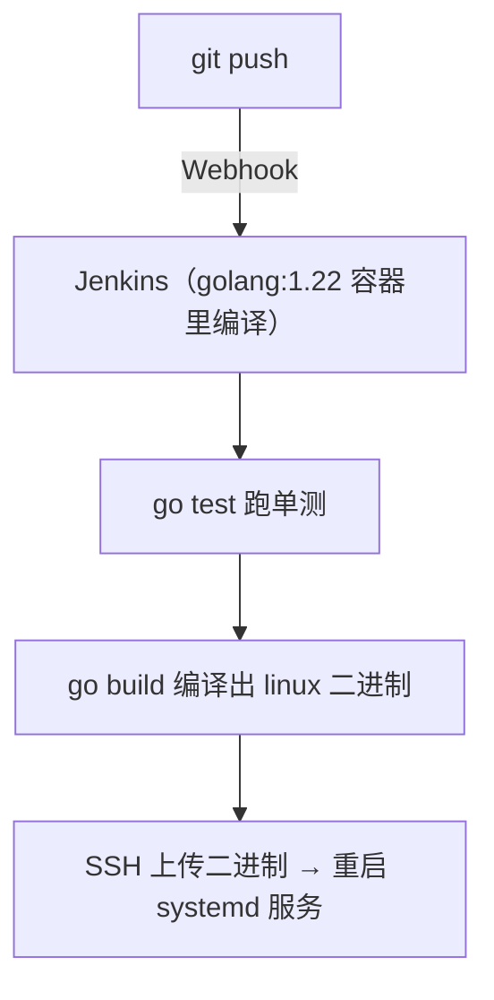

# 06 实战：部署 Go 项目

Go 项目在 Jenkins 里有两条主流路线：**镜像部署**（和 Python 篇完全一样，只是 Dockerfile 换成 Go 的多阶段构建）和 **二进制 + systemd 部署**（Go 独有优势，产物就一个文件）。镜像路线直接套用上一章，本篇重点讲二进制路线，最后给出镜像路线的差异点。

## 1. 二进制路线整体思路



## 2. 前置条件

- 凭据 `deploy-server` 已配置
- 服务器上已建好 systemd 服务（首次手动配置一次）：

```ini title="/etc/systemd/system/go-api.service"
[Unit]
Description=Go API Service
After=network.target

[Service]
ExecStart=/opt/go-api/server
Restart=always
RestartSec=3
Environment=GIN_MODE=release

[Install]
WantedBy=multi-user.target
```

```bash
mkdir -p /opt/go-api
systemctl daemon-reload
systemctl enable go-api
```

## 3. 编写 Jenkinsfile

```groovy title="Jenkinsfile"
pipeline {
    agent {
        docker {
            image 'golang:1.22-alpine'
            // Go 模块缓存挂出来，二次构建不重新下依赖
            args '-v /opt/jenkins-cache/go:/go/pkg/mod'
        }
    }

    options {
        timeout(time: 15, unit: 'MINUTES')
        disableConcurrentBuilds()
        buildDiscarder(logRotator(numToKeepStr: '20'))
    }

    triggers {
        githubPush()
    }

    environment {
        GOPROXY    = 'https://goproxy.cn,direct'   // 国内代理，下载依赖加速
        SERVER     = 'root@192.168.1.100'
        DEPLOY_DIR = '/opt/go-api'
        APP_NAME   = 'go-api'
    }

    stages {
        stage('拉取代码') {
            steps { checkout scm }
        }

        stage('单元测试') {
            steps { sh 'go test ./...' }
        }

        stage('编译') {
            steps {
                // 静态编译 + 去掉调试信息，产物就一个 server 文件
                sh 'CGO_ENABLED=0 GOOS=linux GOARCH=amd64 go build -ldflags="-s -w" -o server .'
            }
        }

        stage('部署') {
            when { branch 'master' }
            steps {
                sshagent(['deploy-server']) {
                    sh '''
                        # 1. 新二进制先传成 server.new，不直接覆盖正在运行的文件
                        scp -o StrictHostKeyChecking=no server $SERVER:$DEPLOY_DIR/server.new

                        # 2. 备份旧版本 → 原子替换 → 重启服务
                        ssh -o StrictHostKeyChecking=no $SERVER "
                            cd $DEPLOY_DIR &&
                            [ -f server ] && cp server server.bak || true &&
                            mv server.new server &&
                            chmod +x server &&
                            systemctl restart $APP_NAME &&
                            sleep 2 &&
                            systemctl is-active $APP_NAME
                        "
                    '''
                }
            }
        }
    }

    post {
        success { echo '部署完成' }
        failure { echo '构建/部署失败！如果是部署阶段失败，可用 server.bak 手动回滚' }
        always  { cleanWs() }
    }
}
```

关键细节：

- **`go test ./...` 放在编译前**：测试不过直接终止，坏代码到不了服务器。这也是编译型语言在 CI 里的天然优势
- **先传 `server.new` 再 `mv`**：直接 scp 覆盖正在运行的二进制会报 `text file busy`；`mv` 是原子操作，不会出现半个文件
- **留一份 `server.bak`**：部署完发现有问题，登上服务器 `mv server.bak server && systemctl restart go-api` 一分钟回滚
- **`systemctl is-active` 做部署后检查**：服务没起来流水线直接红，第一时间发现问题

## 4. 镜像路线的差异点

如果项目里还有 MySQL/Redis 等容器、或者要部署多台机器，建议改走镜像路线。流水线直接复用 [05-部署Python项目](05-部署Python项目.md) 的 Jenkinsfile，只有两处不同：

1. `Dockerfile` 换成 Go 的多阶段构建（写法见 [部署Go应用](../03-部署实战/03-部署Go应用.md)）
2. `agent any` 不变（构建镜像不需要 golang 环境，Dockerfile 的 builder 阶段里自带）

两条路线怎么选，和 [部署Go应用](../03-部署实战/03-部署Go应用.md) 结尾那张表的结论一致：**有容器化生态就走镜像，单体小服务走二进制 + systemd**。

## 5. 常见问题

**编译报 `go: module lookup disabled` 或下载依赖超时？**
`GOPROXY` 没生效，确认 environment 里配了 `https://goproxy.cn,direct`。

**重启后接口 502？**
看服务日志 `journalctl -u go-api -n 50`。常见原因：配置文件路径不对（systemd 的工作目录默认不是二进制所在目录，可在 unit 里加 `WorkingDirectory=/opt/go-api`）。

**二进制在服务器上跑不起来，报 `not found`？**
没关 CGO，二进制动态链接了构建机的 glibc。确认编译命令带 `CGO_ENABLED=0`。

## 小结

- Go 的二进制路线：**test → build → scp 新文件 → 原子替换 → systemctl restart**
- 传 `server.new` 再 `mv`，避开 `text file busy`；留 `server.bak` 随时回滚
- 部署后用 `systemctl is-active` 验活，失败流水线立刻变红
- 有容器生态就切镜像路线，Jenkinsfile 复用 Python 篇

到这里 Jenkins 三类项目的部署都打通了。最后一篇，把「Jenkins 机器怎么连上生产机器」的底层链路讲透：[07-跨服务器部署](07-跨服务器部署.md)
