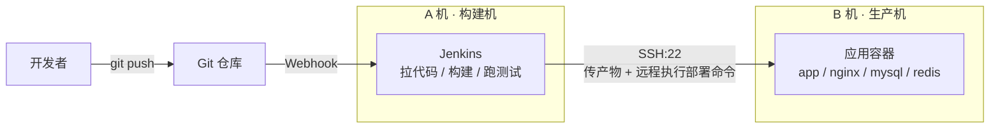

# 07 实战：跨服务器部署（A 机 Jenkins 部署 B 机应用）

前面三个实战的 Jenkinsfile 里都出现过 `sshagent(['deploy-server'])`，但「Jenkins 所在的 A 机到底是怎么连上 B 机的」一直没有展开讲。本篇把这条链路从零到通完整走一遍——这也是公司里最标准的架构：**构建和部署分离，Jenkins 永远不和生产应用挤同一台机器**。

## 1. 架构与角色分工



为什么要分两台机器？

- **资源隔离**：构建（npm install、go build、docker build）是 CPU/内存大户，和线上应用抢资源会造成接口卡顿
- **安全隔离**：Jenkins 插件多、暴露面大，被打穿也不直接等于生产沦陷
- **可扩展**：以后 B 机变成 B1、B2、B3 多台，A 机不用动，加循环就行

角色约定（下文一直沿用）：

| 机器 | IP 示例 | 职责 |
|------|---------|------|
| A 机 | 10.0.0.10 | 跑 Jenkins（Compose 安装，见 [02-安装Jenkins](02-安装Jenkins.md)） |
| B 机 | 10.0.0.20 | 只跑应用，装好 Docker 即可 |

## 2. 一次性配置：打通 A → B 的 SSH

核心就一件事：**让 A 机上的 Jenkins 能免密 SSH 到 B 机**。原理和你本机免密登服务器完全一样——A 持有私钥，B 的 `authorized_keys` 里放公钥。

### 2.1 在 A 机生成专用密钥对

不要复用任何人的个人密钥，给部署单独生成一对：

```bash
# 在 A 机上执行（不设置密码短语，直接回车）
ssh-keygen -t ed25519 -C "jenkins-deploy" -f ~/jenkins_deploy_key
```

得到两个文件：`jenkins_deploy_key`（私钥，等下交给 Jenkins）和 `jenkins_deploy_key.pub`（公钥，等下放到 B 机）。

### 2.2 把公钥装到 B 机

```bash
# 在 A 机上执行，把公钥追加到 B 机的 authorized_keys
ssh-copy-id -i ~/jenkins_deploy_key.pub root@10.0.0.20

# 没有 ssh-copy-id 就手动来：
cat ~/jenkins_deploy_key.pub | ssh root@10.0.0.20 \
  "mkdir -p ~/.ssh && chmod 700 ~/.ssh && cat >> ~/.ssh/authorized_keys && chmod 600 ~/.ssh/authorized_keys"
```

> 生产环境更建议在 B 机建一个专门的 `deploy` 用户并加入 `docker` 组，不用 root。本篇为聚焦主线仍用 root 演示。

### 2.3 验证免密登录

```bash
# 在 A 机上执行，能直接进去不要密码才算通
ssh -i ~/jenkins_deploy_key root@10.0.0.20 "hostname && docker --version"
```

这一步不通，后面全都不用试。连不上先排查：B 机安全组/防火墙放行了 A 机的 22 端口吗？IP 写对了吗？

## 3. 把私钥交给 Jenkins 托管

私钥绝不能写进 Jenkinsfile 或仓库，要放进 Jenkins 凭据库：

1. **Manage Jenkins → Credentials → System → Global credentials → Add Credentials**
2. Kind 选 **SSH Username with private key**
3. ID 填 `deploy-server`（Jenkinsfile 里引用的就是这个 ID）
4. Username 填 `root`（B 机上的登录用户）
5. Private Key 选 Enter directly，把 `jenkins_deploy_key` **私钥文件的完整内容**（含首尾的 BEGIN/END 行）粘进去

配好之后，A 机上那份私钥文件就可以 `shred -u ~/jenkins_deploy_key` 删掉了——它已经安全地住进 Jenkins 里。

## 4. known_hosts：第一次连接的信任问题

你手动 SSH 一台新机器时会看到 `Are you sure you want to continue connecting (yes/no)?`——流水线里没人能敲 yes，所以必须提前处理，两种方式：

**方式一（教程示例用的）**：连接参数加 `-o StrictHostKeyChecking=no`，跳过校验。内网环境、IP 固定时够用，但理论上有被中间人劫持的风险。

**方式二（更严谨）**：把 B 机的主机指纹提前录入 Jenkins 容器的 known_hosts：

```bash
# 在 A 机上执行（jenkins 是容器名）
docker exec jenkins bash -c "mkdir -p /var/jenkins_home/.ssh && ssh-keyscan 10.0.0.20 >> /var/jenkins_home/.ssh/known_hosts"
```

录入之后 Jenkinsfile 里就不需要 `-o StrictHostKeyChecking=no` 了。

## 5. 完整流水线：把一个 Compose 项目部署到 B 机

以一个「代码里带 `compose.yaml` 和 Dockerfile」的项目为例（比如上一章的全栈项目），思路是**把代码打包传到 B 机，在 B 机上构建并拉起**：

```groovy title="Jenkinsfile"
pipeline {
    agent any

    options {
        timeout(time: 20, unit: 'MINUTES')
        disableConcurrentBuilds()
        buildDiscarder(logRotator(numToKeepStr: '20'))
    }

    triggers {
        githubPush()
    }

    environment {
        SERVER     = 'root@10.0.0.20'        // B 机
        DEPLOY_DIR = '/srv/myproject'        // B 机上的项目目录
    }

    stages {
        stage('拉取代码') {
            steps { checkout scm }
        }

        stage('打包上传') {
            steps {
                sshagent(['deploy-server']) {
                    sh '''
                        # 1. 打包工作区（排除 .git，体积小传得快）
                        tar --exclude=.git -czf /tmp/app.tar.gz .

                        # 2. 传到 B 机并解压到部署目录
                        scp -o StrictHostKeyChecking=no /tmp/app.tar.gz $SERVER:/tmp/
                        ssh -o StrictHostKeyChecking=no $SERVER "
                            mkdir -p $DEPLOY_DIR &&
                            tar -xzf /tmp/app.tar.gz -C $DEPLOY_DIR &&
                            rm /tmp/app.tar.gz
                        "
                    '''
                }
            }
        }

        stage('远程部署') {
            when { branch 'master' }
            steps {
                sshagent(['deploy-server']) {
                    sh '''
                        ssh -o StrictHostKeyChecking=no $SERVER "
                            cd $DEPLOY_DIR &&
                            docker compose up -d --build &&
                            docker image prune -f
                        "
                    '''
                }
            }
        }

        stage('部署后验证') {
            steps {
                sshagent(['deploy-server']) {
                    // 给服务几秒启动时间，再打健康检查接口
                    sh '''
                        sleep 5
                        ssh -o StrictHostKeyChecking=no $SERVER \
                            "curl -sf http://localhost:8080/api/health"
                    '''
                }
            }
        }
    }

    post {
        success { echo '部署到 B 机完成' }
        failure { echo '部署失败，检查上方日志' }
        always  { cleanWs() }
    }
}
```

几个关键点：

- **`sshagent(['deploy-server'])`**：把第 3 步配置的私钥临时注入到块内的 ssh/scp 命令，块外拿不到
- **所有远程操作都是「ssh B 机执行命令」**：A 机上的 Jenkins 只负责发号施令，构建和运行都发生在 B 机
- **`部署后验证` 阶段必不可少**：`curl -sf` 在接口非 200 时返回非零，流水线直接红，坏版本第一时间暴露

### 这个方案的适用边界

「传代码到 B 机再 build」简单直接，但构建吃的是 B 机（生产机）的资源，项目大了会影响线上服务。规模上来后升级为**镜像仓库路线**：A 机构建镜像 → push 仓库 → B 机只 `pull + up -d`，B 机零构建压力，流水线写法见 [05-部署Python项目](05-部署Python项目.md)——那套 Jenkinsfile 本身就是跨服务器架构，SSH 打通方式和本篇完全一样。

## 6. 以后有多台 B 机怎么办？

把 SERVER 换成列表循环即可（每台 B 机都要做第 2 步的公钥安装）：

```groovy
environment {
    SERVERS = 'root@10.0.0.20 root@10.0.0.21 root@10.0.0.22'
}

// 部署 stage 里：
sh '''
    for s in $SERVERS; do
        echo "==== 部署 $s ===="
        ssh -o StrictHostKeyChecking=no $s "cd /srv/myproject && docker compose pull && docker compose up -d"
    done
'''
```

多到十几台、几十台时，就该考虑 Ansible 或 K8s 了，Jenkins 只负责触发。

## 7. 常见报错排查

**`Host key verification failed`？**
没处理 known_hosts。加 `-o StrictHostKeyChecking=no`，或按第 4 节方式二录入指纹。

**`Permission denied (publickey)`？**
按顺序查三件事：① Jenkins 凭据里的私钥和 B 机 authorized_keys 里的公钥是不是同一对；② 凭据的 Username 和 ssh 命令里的用户一致吗（`root@` 就要配 root）；③ B 机上 `~/.ssh` 权限必须是 700、`authorized_keys` 必须是 600，权限太开 sshd 会直接拒绝。

**`dial tcp x.x.x.x:22: i/o timeout` 或连接超时？**
网络不通，和密钥无关。检查 B 机防火墙/云安全组是否放行 A 机 IP 的 22 端口、IP 是否写成了内网/公网混淆。

**scp 传上去的文件，应用读不了？**
用 root 部署时留意文件属主。B 机上应用容器若以非 root 运行，解压后 `chown -R` 一次对应用户。

## 小结

- 跨服务器部署的本质：**A 机持私钥，B 机放公钥，流水线里全是「ssh B 机执行命令」**
- 密钥专用、私钥进 Jenkins 凭据库、验证通过后删掉 A 机上的私钥文件
- 第一次连接的 host key 问题要提前处理，内网图省事用 `StrictHostKeyChecking=no`，严谨做法是 `ssh-keyscan` 录指纹
- 一定要有「部署后验证」阶段，`curl -sf` 打健康检查接口
- 小项目传代码远程 build，上了规模切镜像仓库路线，B 机只 pull 不 build

到这里 Jenkins 一章就全部结束了。遇到问题查阅 [附录：常见问题排查](../05-附录/01-常见问题排查.md)。
