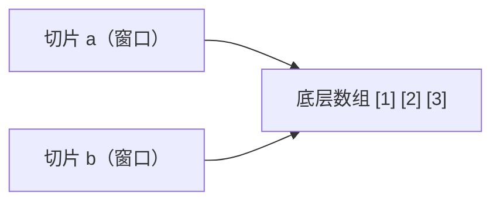

# 3.1 数组与切片

> 本节目标：了解数组，重点掌握切片（slice）——Go 中使用频率最高的数据结构。

先看一个用第二章知识解决不了的问题：**存全班 40 个人的成绩**。

```go
score1 := 90
score2 := 85
score3 := 77
// ……还要写 37 个？算平均分难道 score1 + score2 + ... + score40？
```

显然不行。我们需要能**把一串数据装进一个变量**的东西。Go 给了两个：**数组**（定长）和**切片**（变长）。先说结论：实际开发 95% 用切片，但切片是建立在数组之上的，所以先花五分钟看懂数组。

## 一、数组：定长的序列

数组是**固定长度**的同类型元素序列：

```go
var arr [3]int              // 长度为 3 的 int 数组，零值是 [0 0 0]
arr[0] = 10                 // 下标从 0 开始
arr[1] = 20

nums := [3]int{1, 2, 3}     // 声明并初始化
auto := [...]int{1, 2, 3, 4}   // [...] 让编译器自己数，len(auto) == 4

fmt.Println(len(arr))       // 3
```

拆一下声明：

```
var arr [3]int
         ↑  ↑
       长度 元素类型   —— 一旦声明，长度永远是 3，加不了减不了
```

数组有两个"怪脾气"，也正是它不常用的原因：

**脾气 1：长度是类型的一部分**。`[3]int` 和 `[4]int` 是**两种不同的类型**，不能互相赋值，函数收 `[3]int` 就不能传 `[4]int`——太死板了。

**脾气 2：赋值和传参会复制整个数组**：

```go
a := [3]int{1, 2, 3}
b := a          // b 是 a 的完整拷贝，两块独立内存
b[0] = 100
fmt.Println(a)  // [1 2 3] —— a 没变
```

数组了解到这就够了。**记住这两个脾气**，一会儿和切片对比时反差极大。

## 二、切片：可变长的序列（本节主角）

切片（slice）就是"可变长的数组"，声明时 `[]` 里**不写长度**：

```go
var s []int                     // nil 切片，长度 0
nums := []int{1, 2, 3}          // 声明并初始化
names := []string{"张三", "李四"}
```

### 基本操作

```go
nums := []int{10, 20, 30}

fmt.Println(nums[0])    // 10       访问
nums[1] = 200           //          修改
fmt.Println(len(nums))  // 3        长度

for i, v := range nums {           // 遍历（2.4 的 for range）
    fmt.Println(i, v)
}
```

> ⚠️ **下标越界不是编译错误，是运行时崩溃（panic）**：
>
> ```go
> fmt.Println(nums[5])   // panic: runtime error: index out of range [5] with length 3
> ```
>
> 程序当场死亡。访问前确保 `i < len(nums)`——还记得 2.3 的短路求值吗？`if i < len(nums) && nums[i] > 0` 就是标准防越界姿势。

### append：追加元素（每天要写一百遍）

```go
var s []int                 // 空切片
s = append(s, 1)            // [1]
s = append(s, 2, 3)         // [1 2 3]，一次可追加多个

other := []int{4, 5}
s = append(s, other...)     // [1 2 3 4 5]，追加整个切片要 ... 展开（和可变参数一样）
```

> ⚠️ **本节头号大坑：append 的结果必须赋回去！**
>
> ```go
> append(s, 6)        // ❌ append(...) evaluated but not used —— 编译直接拦住
> s = append(s, 6)    // ✅
> ```
>
> `append` 不修改原切片，而是**返回一个新切片**。好在 Go 编译器会报错提醒——对比 Python 的 `lst = lst.append(x)` 悄悄变 None，Go 的编译器像个严格的教练，错误当场指出。
>
> 另一个好消息：**nil 切片可以直接 append**。`var s []int` 之后不用 make、不用初始化，直接 `s = append(s, 1)` 完全合法——"零值可用"哲学又出现了。

### 切一段：切片的切片

"切片"这名字就来自这个操作——语法 `s[开始:结束]`，**含开始、不含结束**（左闭右开）：

```go
s := []int{0, 1, 2, 3, 4, 5}

fmt.Println(s[1:4])    // [1 2 3]   下标 1、2、3，不含 4
fmt.Println(s[:3])     // [0 1 2]   省略开始 = 从头
fmt.Println(s[3:])     // [3 4 5]   省略结束 = 到尾
fmt.Println(s[:])      // [0 1 2 3 4 5]
```

记左闭右开的窍门：**`s[a:b]` 切出来的长度就是 b−a**，`s[1:4]` 长度 3。

### make：预先开好长度

```go
s := make([]int, 3)        // 长度 3，元素都是零值 [0 0 0]
s2 := make([]int, 0, 10)   // 长度 0，容量 10（预留 10 个位置，append 时不用反复搬家）
```

新手先记住 `make([]类型, 长度)` 这一种用法就够。

## 三、切片的本质：一扇窗（全节最重要）

数组赋值是**复制**，切片赋值却是——

```go
a := []int{1, 2, 3}
b := a              // 注意看
b[0] = 100
fmt.Println(a)      // [100 2 3] —— a 也变了！！
```

**惊了？** 这不是 bug，是切片的本质决定的：

**切片本身不装数据**。它只是三个字段的小结构：指针（指向底层数组）+ 长度 len + 容量 cap。可以把切片想象成**开在底层数组上的一扇窗**：



`b := a` 复制的是窗口（那三个字段），不是数组本身。透过 b 改数据，透过 a 当然也看得见。

切出来的子切片同样共享底层数组：

```go
s := []int{1, 2, 3, 4, 5}
sub := s[1:3]       // [2 3]，窗口对准了原数组的中段
sub[0] = 999
fmt.Println(s)      // [1 999 3 4 5] —— 原切片跟着变
```

### 想要真正独立的副本：copy

```go
a := []int{1, 2, 3}
b := make([]int, len(a))   // 先开好同样大小的新房
copy(b, a)                 // 把 a 的内容搬进去（注意：目标在前，来源在后）
b[0] = 100
fmt.Println(a)             // [1 2 3]，互不影响
```

> 💡 关于容量 cap 和扩容：append 超出容量时，Go 会分配一个更大的新数组并把数据搬过去——这时新旧切片就"分家"了。扩容细节是进阶话题，新手阶段记两条实用结论就好：
> 1. **切片赋值/传参共享数据**，要独立副本用 `copy`
> 2. **append 结果必须赋回原变量**

## 四、常用套路

```go
// 判空：用 len，别拿 nil 判断
if len(s) == 0 { /* 空的 */ }

// 删除下标 i 的元素（Go 没有内置删除，用前后两段拼接）
s = append(s[:i], s[i+1:]...)

// 求和：range 循环
total := 0
for _, v := range nums {
    total += v
}

// 排序、查找、最值：标准库 slices 包（Go 1.21+）
import "slices"

slices.Sort(nums)                        // 升序排序（就地修改）
fmt.Println(slices.Contains(nums, 3))    // 是否包含
fmt.Println(slices.Max(nums))            // 最大值
```

## 五、二维切片

切片的元素也可以是切片，表格、棋盘就用它：

```go
grid := [][]int{
    {1, 2, 3},
    {4, 5, 6},
}
fmt.Println(grid[1][2])   // 6（第 2 行第 3 列）
```

## 本节报错/怪象速查表

| 现象 | 人话翻译 |
|------|----------|
| `panic: index out of range [5] with length 3` | 下标越界，运行时崩溃，先判 `len` |
| `append(...) evaluated but not used` | append 结果没接收，写 `s = append(s, x)` |
| `cannot use a (variable of type [3]int) as [4]int` | 数组长度是类型的一部分，长度不同就是不同类型 |
| 改了 b，a 跟着变 | 切片赋值共享底层数组，独立副本用 `copy` |
| `s[1:4]` 只有 3 个元素 | 左闭右开，长度 = 4−1 |

## 练习

**1. 动手**：创建空 int 切片，循环 append 1~10，打印切片和长度。

**2. 动手**：给定 `s := []int{5, 3, 8, 1, 9}`，手写循环找最大最小值，再用 `slices.Max/Min` 验证。

**3. 猜输出**：先别运行，猜猜打印什么？为什么？

```go
a := []int{1, 2, 3}
b := a[:2]
b[0] = 99
fmt.Println(a)

c := make([]int, len(a))
copy(c, a)
c[1] = -1
fmt.Println(a)
```

**4. 修 bug**：下面的函数想收集切片里的偶数，但结果永远是空的，找出原因：

```go
func evens(nums []int) []int {
    result := []int{}
    for _, n := range nums {
        if n%2 == 0 {
            append(result, n)
        }
    }
    return result
}
```

**5. 挑战**：写函数 `reverse(s []int) []int` 返回**逆序的新切片**（要求不改动原切片——想想该用什么防共享）。

<details>
<summary>点击查看答案</summary>

```go
// 1
var s []int
for i := 1; i <= 10; i++ {
    s = append(s, i)
}
fmt.Println(s, len(s))   // [1 2 3 4 5 6 7 8 9 10] 10

// 2
s := []int{5, 3, 8, 1, 9}
min, max := s[0], s[0]
for _, v := range s {
    if v < min {
        min = v
    }
    if v > max {
        max = v
    }
}
fmt.Println(min, max)    // 1 9
```

**3. 输出：**

```
[99 2 3]    ← b 是 a 上的窗口，共享底层数组，改 b[0] 就是改 a[0]
[99 2 3]    ← c 是 copy 出来的独立副本，改 c 不影响 a
```

**4.** `append(result, n)` 的返回值没有接收——编译器会报 `append(...) evaluated but not used`。改成：

```go
result = append(result, n)
```

```go
// 5
func reverse(s []int) []int {
    result := make([]int, len(s))
    for i, v := range s {
        result[len(s)-1-i] = v   // 直接写新切片，不碰原切片
    }
    return result
}
```

</details>

## 本节小结

- 数组定长、赋值复制、长度属于类型——了解即可，实战用切片
- 切片 `[]int{}` 创建、`append` 追加（**必须赋回去**）、`s[a:b]` 左闭右开切段
- **切片是底层数组上的一扇窗**：赋值/切段共享数据，独立副本用 `copy`
- nil 切片可直接 append，"零值可用"
- 下标越界是运行时 panic，访问前判 `len`
- 排序查找用标准库 `slices` 包

下一节：[3.2 map 映射](02-maps.md)
