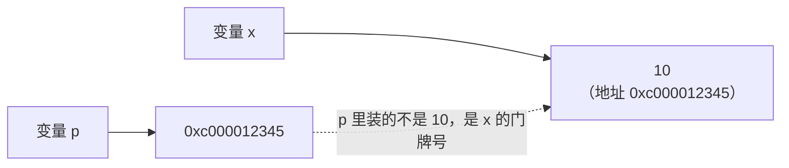

# 3.4 指针

> 本节目标：真正理解指针——不只是会写 `&` 和 `*`，而是明白它解决什么问题。Go 的指针比 C 简单得多，别怕。

上一节留了个尾巴：函数想修改结构体，参数要写 `*Student`，调用要写 `&s`。这一节把这两个符号背后的原理彻底讲透。**指针是很多人学 C 时的噩梦，但在 Go 里它其实只干一件事**——看完这节你会觉得"就这？"。

## 一、先复盘问题：函数为什么改不动外面的变量

```go
func addOne(n int) {
    n++                  // 改的是拷贝
}

func main() {
    x := 10
    addOne(x)
    fmt.Println(x)       // 10 —— 没变
}
```

原因第二章讲作用域时就见过：**传参是复制**。`addOne(x)` 时，x 的值 10 被复印了一份交给参数 n，函数里 `n++` 改的是复印件，原件 x 毫发无损。

那怎么才能让函数改到原件？换个思路——**别把值给它，把"原件放在哪"告诉它**。

## 二、指针是什么

变量都住在内存里，每块内存都有编号，叫**地址**（好比门牌号）。

**指针 = 存着某个变量地址的变量。**

打个比方：

- **传值** = 把文件**复印**给别人：他在复印件上涂改，原件不受影响
- **传指针** = 把文件的**存放位置**写在纸条上给别人：他顺着位置找到原件改，原件真的变了

指针就是那张纸条。

## 三、两个操作符：`&` 和 `*`

全部指针语法就这两个符号：

| 操作符 | 读法 | 作用 |
|-------|------|------|
| `&x` | 取地址 | 得到变量 x 的地址（生成一张指向 x 的"纸条"） |
| `*p` | 解引用 | 顺着纸条 p 找到原件（读它或改它） |

```go
func main() {
    x := 10

    p := &x               // p 是指向 x 的指针
    fmt.Println(p)        // 0xc000012345 —— 一串地址，每次运行都不同
    fmt.Println(*p)       // 10 —— 顺着地址取到 x 的值

    *p = 99               // 顺着地址把 x 改掉
    fmt.Println(x)        // 99 —— x 真的变了！
}
```

在脑子里画这张图：



类型怎么写：`*int` 读作"指向 int 的指针"，`*Student` 是"指向 Student 的指针"。`p := &x` 后，`p` 的类型就是 `*int`——用 `%T` 打印验证一下。

> 💡 同一个 `*` 出现在两个地方，含义不同，很多人在这懵：
> - **类型里**的 `*`：`var p *int` —— "p 是个指针"（名词）
> - **表达式里**的 `*`：`*p = 99` —— "解开 p 拿原件"（动词）
>
> 区分口诀：跟着类型走的是名词，跟着变量走的是动词。

## 四、用指针解决开头的问题

```go
func addOne(n *int) {    // 参数类型 *int：我要收的是"纸条"
    *n++                 // 顺着纸条找到原件，加 1
}

func main() {
    x := 10
    addOne(&x)           // 把 x 的地址写成纸条传过去
    fmt.Println(x)       // 11 —— 改到原件了！
}
```

对照一遍调用链：`&x` 生成地址 → 参数 `n` 收到地址 → `*n++` 顺着地址改到 x。两个符号一送一收，配合完成"远程修改"。

## 五、结构体指针：指针 90% 的用武之地

实际开发中，给 int 传指针的场景很少，**指针几乎都用在结构体上**——上一节的伏笔在此兑现：

```go
type Student struct {
    Name  string
    Score float64
}

func addBonus(s *Student, bonus float64) {
    s.Score += bonus     // 注意：直接点，不用写 (*s).Score！
}

func main() {
    stu := Student{Name: "张三", Score: 85}
    addBonus(&stu, 5)
    fmt.Println(stu.Score)   // 90
}
```

**好消息**：通过结构体指针访问字段，直接 `s.Score` 就行——Go 自动帮你解引用，不用像 C 那样写 `s->Score` 或 `(*s).Score`。这个"语法糖"让 Go 的指针体验好一个档次：**结构体指针用起来和结构体本身几乎没差别**，唯一的区别是"改了算数"。

### 创建结构体指针的两种写法

```go
p1 := &Student{Name: "张三"}    // 最常见：字面量前直接加 &
p2 := new(Student)              // new：创建零值 Student 返回指针（较少用）

fmt.Println(p1.Name)            // 张三 —— 照常点
```

`&Student{...}` 这个形态以后会大量出现在各种库的用法里（`&http.Server{...}`、`&sql.DB{...}`），现在就眼熟它。

## 六、nil：指针的零值

2.1 的零值表里那行 "指针 → nil" 在这里兑现。没指向任何东西的指针就是 `nil`，**解引用 nil 指针 = 顺着一张空白纸条找文件 = 程序当场崩溃**：

```go
var p *int                // 只声明，p == nil
fmt.Println(*p)           // ❌ panic: runtime error: invalid memory address
                          //    or nil pointer dereference
```

`nil pointer dereference` 是 Go 程序员生涯中见得最多的运行时错误，**没有之一**。以后看到它，条件反射：某个指针没赋值就被用了。防御姿势（2.3 的短路求值再立功）：

```go
if p != nil {
    fmt.Println(*p)       // 安全
}
```

## 七、指针 vs 值：到底怎么选

新手实用决策表：

| 场景 | 用什么 | 原因 |
|------|-------|------|
| 函数需要**修改**传入的结构体 | 指针 | 传值改不了原件 |
| 结构体**很大**（几十个字段） | 指针 | 免拷贝开销 |
| 小结构体、只读不改 | 值 | 简单安全，没有"被谁改了"的心智负担 |
| int / string / bool 参数 | 值 | 几乎不需要指针 |
| 切片、map 参数 | 值 | **它们本身就是共享语义，别再套指针** |

最后一行展开说：`*[]int`、`*map[string]int` 是新手典型的画蛇添足——切片和 map 传值时数据本来就共享（3.1、3.2 讲过），再套指针纯属自我折磨。

拿不准时的粗暴原则：**结构体传指针，其他传值**，错不到哪去。

至此，三章的"复制还是共享"完整版图拼齐了：

| 类型 | 默认行为 | 想共享/修改怎么办 |
|------|---------|------------------|
| 基本类型、数组、结构体 | 复制 | 传指针 `&x` |
| 切片、map | 天然共享 | 什么都不用做 |

## 八、Go 指针 vs C 指针（没学过 C 直接跳过）

Go 的指针做了大量减法，把 C 里最危险的部分全砍了：

- ❌ 没有指针运算：`p++` 不存在，不会"走出"变量的地盘
- ❌ 不能把整数强转成指针乱指内存
- ✅ 有垃圾回收，不用手动 free，没有悬空指针
- ✅ **返回局部变量的指针完全安全**（C 的经典大坑，Go 编译器会自动把它挪到堆上）：

```go
func newStudent() *Student {
    s := Student{Name: "新同学"}
    return &s        // Go 里完全合法，而且是构造函数的惯用写法！
}
```

最后这条要特别记住——`return &s` 在 Go 里不但没问题，还是第四章"构造函数"模式的标准姿势。

## 本节报错/怪象速查表

| 现象 | 人话翻译 |
|------|----------|
| `panic: ... nil pointer dereference` | 解引用了没赋值的指针，检查它在哪该被赋值 |
| `invalid operation: p++ (non-numeric type *int)` | Go 没有指针运算 |
| `cannot use x (variable of type int) as *int value` | 函数要指针你传了值，加 `&`；反过来就去掉 `&` |
| 函数改了参数，外面没变 | 传的是值不是指针——本章第一坑，永远第一个排查 |
| `cannot take the address of 42` | 字面量/常量没有地址，`&42` 不合法，先存进变量 |

## 练习

**1. 动手**：声明 `x := 100`，创建指向它的指针 p，依次打印：p 的值（地址）、`*p`、p 的类型（`%T`）；然后通过 p 把 x 改成 200，打印 x 验证。

**2. 动手**：写函数 `swap(a, b *int)` 用指针交换两个变量的值，在 main 里验证。（Go 里日常交换用 `x, y = y, x` 就够，这题纯为练指针手感。）

**3. 猜输出**：先别运行，猜猜打印什么？

```go
func reset(n *int) {
    *n = 0
}

func rename(s Student) {
    s.Name = "无名氏"
}

func main() {
    x := 42
    reset(&x)

    stu := Student{Name: "张三"}
    rename(stu)

    fmt.Println(x, stu.Name)
}
```

**4. 修 bug**：下面的程序会 panic，先说出报错内容，再修好它：

```go
type Config struct {
    Debug bool
}

func main() {
    var cfg *Config
    cfg.Debug = true
    fmt.Println(cfg.Debug)
}
```

**5. 挑战**：定义 `Counter` 结构体（`Count int` 字段），写函数 `increment(c *Counter)` 计数加一；再写一个 `newCounter() *Counter` 返回新计数器的指针。循环调用 increment 5 次后打印结果。

<details>
<summary>点击查看答案</summary>

```go
// 1
x := 100
p := &x
fmt.Println(p, *p)        // 0xc00001c030 100
fmt.Printf("%T\n", p)     // *int
*p = 200
fmt.Println(x)            // 200

// 2
func swap(a, b *int) {
    *a, *b = *b, *a
}

func main() {
    x, y := 1, 2
    swap(&x, &y)
    fmt.Println(x, y)     // 2 1
}
```

**3. 输出 `0 张三`**：
- `reset(&x)` 传了指针，`*n = 0` 改到原件，x 变 0
- `rename(stu)` 传的是值，函数里改的是拷贝，stu.Name 不变——两行代码把本章核心对比浓缩完了

**4.** 报错 `panic: runtime error: invalid memory address or nil pointer dereference`。`var cfg *Config` 只声明了指针（nil），没有实际的 Config 对象可指。修复：

```go
cfg := &Config{}      // 创建一个真的 Config，拿到它的指针
cfg.Debug = true
fmt.Println(cfg.Debug)   // true
```

```go
// 5
type Counter struct {
    Count int
}

func increment(c *Counter) {
    c.Count++
}

func newCounter() *Counter {
    return &Counter{}     // 返回局部变量的指针，Go 里完全安全
}

func main() {
    c := newCounter()
    for i := 0; i < 5; i++ {
        increment(c)
    }
    fmt.Println(c.Count)  // 5
}
```

</details>

## 本节小结

- 指针 = 存地址的变量；**传值是复印，传指针是给存放位置**
- 两个符号：`&x` 取地址，`*p` 解引用；类型里的 `*` 是名词（指针类型），表达式里的 `*` 是动词（取原件）
- 结构体指针直接点字段（`s.Score`），Go 自动解引用；`&Student{...}` 是高频形态
- 指针零值是 nil，**解引用 nil 必 panic**——Go 第一大运行时错误
- 选择原则：要修改或结构体大→指针；切片 map 天然共享**不要再套指针**
- 返回局部变量的指针在 Go 里安全且常用（`return &s`）

🎉 第三章完成！切片、map、结构体、指针是 Go 日常开发的四大件，后面所有内容都建立在它们之上。

下一章：[4.1 方法](../04-方法与接口/01-methods.md)
