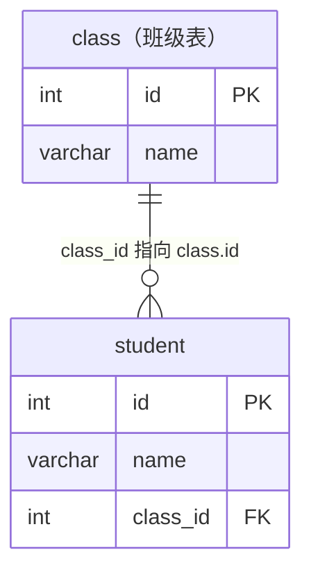
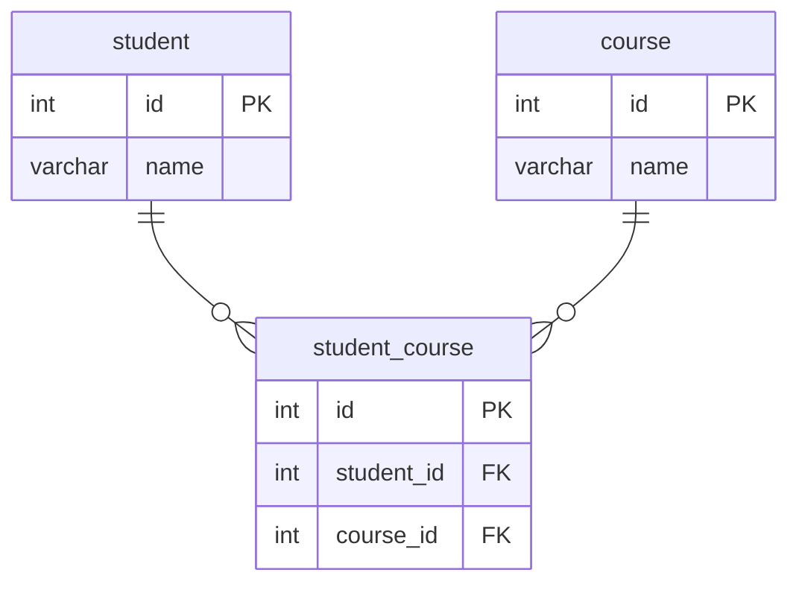
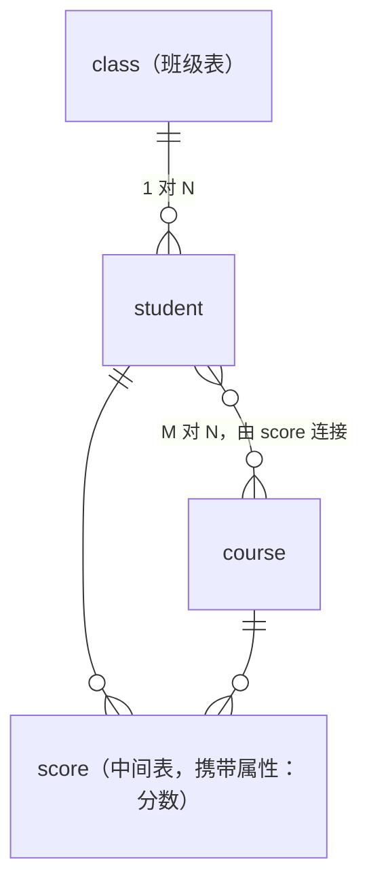

# 4.2 表关系设计：一对一、一对多与多对多

## 📖 本节导读

- 学会判断两个实体之间是哪种关系：一对一、一对多，还是多对多。
- 掌握三种关系各自的落地方式：外键放哪边、什么时候必须建中间表。
- 亲手把 school 库的表关系画出来，看懂"实体—关系"设计思路。
- 认识几种典型的错误设计（逗号大法、外键放反、多对多硬塞），以后绕着走。

---

## 一、为什么要学表关系

上一节学了外键，你已经知道"score.student_id 必须指向 student.id"。但外键只是**工具**，真正的问题在它前面一步：

> 拿到一个需求，比如"做一个学校管理系统"，你怎么知道**该建几张表、外键该放在哪张表的哪一列上**？

这一步叫**表关系设计**，是数据库设计的核心。设计对了，后面的增删改查顺理成章；设计错了，写多少 SQL 都是在泥潭里挣扎。看一个真实的翻车现场：

```sql
-- ❌ 新手经典设计：把学生选的课用逗号塞进一个格子
CREATE TABLE student_bad (
    id      INT PRIMARY KEY AUTO_INCREMENT,
    name    VARCHAR(50),
    courses VARCHAR(200)     -- '数学,英语,计算机'
);
```

这个"逗号大法"看着省事，一用全是灾难：

- 查"选了数学的所有学生"？只能 `LIKE '%数学%'`——上一节刚讲过，`%` 开头的 LIKE 让索引直接失效，而且"高等数学"也会被误伤；
- 想给"张三的数学"记成绩？一个格子里塞了三门课，成绩往哪放？
- 数学改名"数学分析"？所有包含它的格子逐个改字符串，漏一个就脏了。

问题的根源：**关系型数据库的铁律是"一个格子只放一个值"**。学生和课程之间的关系，不该塞进格子里，而应该用**表与表的结构**来表达。怎么表达？先判断关系类型——所有实体间的关系，只有三种。

## 二、判断关系类型：双向提问法

判断两个实体 A、B 的关系，就问两个问题：

```
问题 1：一个 A 能对应几个 B？（1 个 / 多个）
问题 2：一个 B 能对应几个 A？（1 个 / 多个）
```

两个答案组合，得到三种关系：

| 问题 1 | 问题 2 | 关系类型 | 例子 |
|--------|--------|---------|------|
| 1 个 | 1 个 | **一对一（1:1）** | 学生 ↔ 学生档案 |
| 多个 | 1 个 | **一对多（1:N）** | 班级 ↔ 学生 |
| 多个 | 多个 | **多对多（M:N）** | 学生 ↔ 课程 |

拿 school 库现场演练：

- **班级 vs 学生**：一个班级有多个学生 ✔，一个学生只属于一个班级 ✔ → **一对多**
- **学生 vs 课程**：一个学生选多门课 ✔，一门课被多个学生选 ✔ → **多对多**

> 💡 判断依据是**业务规则**，不是数学定理。"一个学生只属于一个班"是这个学校的规定；换成允许双学位的大学，学生和专业就成了多对多。**先问清楚业务，再动手建表**——这也是为什么产品经理说"学生可以转班吗"这种问题时，你要竖起耳朵听。

下面逐个讲三种关系怎么落地成表结构。

## 三、一对多：外键放在"多"的一方

三种关系里最常见的就是一对多，落地规则一句话：

> **谁是"多"，外键就加在谁身上。**

班级 ↔ 学生是一对多，学生是"多"方，所以 `student` 表带 `class_id`：

```sql
CREATE TABLE class (
    id   INT PRIMARY KEY AUTO_INCREMENT,
    name VARCHAR(50) NOT NULL
);

CREATE TABLE student (
    id       INT PRIMARY KEY AUTO_INCREMENT,
    name     VARCHAR(50) NOT NULL,
    class_id INT,                -- 外键：我属于哪个班
    CONSTRAINT fk_student_class FOREIGN KEY (class_id) REFERENCES class(id)
);
```

画成图（`1` 端是父表，`N` 端是子表，箭头表示"指向谁"）：



示例数据——张三、李四的 `class_id` 都是 1，即都指向一班：

| class.id | name |     | student.id | name | class_id |
|----------|------|-----|------------|------|----------|
| 1 | 一班 |     | 1 | 张三 | **1** |
| 2 | 二班 |     | 2 | 李四 | **1** |
|   |      |     | 3 | 王小红 | **2** |

好比每个学生胸前挂一张"我是 X 班的"胸牌（class_id），班级自己什么都不用记——想知道一班有哪些人，去学生堆里找胸牌写着 1 的就行。

### 为什么外键不能放"一"的那边？

反过来设计试试——在 class 表里记学生：

```sql
-- ❌ 错误方向
CREATE TABLE class_bad (
    id          INT PRIMARY KEY,
    name        VARCHAR(50),
    student_ids VARCHAR(200)    -- '1,2,5' ？？
);
```

一个班有多个学生，一个格子放不下多个 id——又绕回"逗号大法"了。**"一个格子只放一个值"这条铁律，决定了外键只能放在"多"方**：每个学生只有一个班，`class_id` 格子里永远只有一个值，刚刚好。

以后的查询你已经会了：3.3 节的 `INNER JOIN class ON student.class_id = class.id`，连接条件就是沿着外键走的。

## 四、多对多：必须建中间表

学生 ↔ 课程是多对多。按上一节的思路，外键该放哪？

- 放 student 表加 `course_id`？一个学生选多门课，一个格子放不下 ❌
- 放 course 表加 `student_id`？一门课有多个学生，同样放不下 ❌

**两边都放不下——这就是多对多的特征**。解决方案是掀桌子：关系不放在任何一方身上，而是**单独建一张表专门存关系**，行话叫**中间表**（也叫连接表、关联表）：

```sql
CREATE TABLE student_course (
    id         INT PRIMARY KEY AUTO_INCREMENT,
    student_id INT NOT NULL,     -- 一手牵学生
    course_id  INT NOT NULL,     -- 一手牵课程
    CONSTRAINT fk_sc_student FOREIGN KEY (student_id) REFERENCES student(id),
    CONSTRAINT fk_sc_course  FOREIGN KEY (course_id)  REFERENCES course(id),
    UNIQUE KEY uk_stu_course (student_id, course_id)   -- 防止同一人重复选同一门课
);
```

中间表的每一行就是一句话："某学生选了某门课"：



示例数据——中间表一行 = 一条「选课事实」：

| student.id | name |     | student_id | course_id |     | course.id | name |
|------------|------|-----|------------|-----------|-----|-----------|------|
| 1 | 张三 |     | 1 | 1 |     | 1 | 数学 |
| 2 | 李四 |     | 1 | 2 |     | 2 | 英语 |
|   |      |     | 2 | 1 |     |   |      |

第二行（student_id=1, course_id=2）就是"张三选了英语"。

一个多对多，就这样被拆成了**两个一对多**：student 对 student_course 一对多，course 对 student_course 也是一对多。规则又统一了——外键还是都在"多"方（中间表）身上。

### 中间表还能携带"关系自己的属性"

回头看 school 库的 `score` 表：

```sql
-- score 表其实就是 student 和 course 的中间表！
CREATE TABLE score (
    id         INT PRIMARY KEY AUTO_INCREMENT,
    student_id INT NOT NULL,
    course_id  INT NOT NULL,
    score      DECIMAL(5,1)      -- ← 多出来的这列
);
```

和 student_course 相比只多了 `score` 一列。**分数属于谁？** 它不属于学生（张三没有"一个分数"，他每门课一个分），也不属于课程（数学没有"一个分数"），它属于"张三选了数学"**这件事本身**——这种"关系自带的属性"，唯一合理的去处就是中间表。

其他常见例子：订单表里的"购买数量"（用户 ↔ 商品）、关注表里的"关注时间"（用户 ↔ 用户）。**判断口诀：这个属性描述的如果是"A 和 B 的这次关联"，就放中间表。**

## 五、一对一：外键 + UNIQUE

一对一用得最少，但也有真实场景。假设要给学生存身份证号、家庭住址、紧急联系人这些**不常用又敏感**的信息：

```sql
CREATE TABLE student_profile (
    id         INT PRIMARY KEY AUTO_INCREMENT,
    student_id INT NOT NULL UNIQUE,   -- ← 关键：外键 + UNIQUE
    id_card    VARCHAR(18),
    address    VARCHAR(200),
    emergency  VARCHAR(50),
    CONSTRAINT fk_profile_student FOREIGN KEY (student_id) REFERENCES student(id)
);
```

结构上它和一对多几乎一样——外键放在从属的一方。**唯一的区别是外键上加了 UNIQUE**：每个 student_id 在档案表里最多出现一次，"一个学生最多一份档案"就从业务约定变成了数据库强制。

> 💡 对比着记：**一对多和一对一的建表方式只差一个 UNIQUE**。去掉 UNIQUE，一个学生就能有多份档案，退化成一对多。

什么时候把一张表拆成一对一的两张？

1. **冷热分离**：姓名、班级天天查（热），家庭住址一年查不了几次（冷），拆开让热表更小更快；
2. **敏感隔离**：身份证号单独放一张表，配合 5.3 节的权限管理，普通账号只授权 student 表，看不到敏感数据；
3. **避免大字段拖累**：简历、头像这类大文本/大对象放副表，主表保持苗条。

如果没有这些需求，**能不拆就不拆**——字段本来就不多还硬拆两张表，查什么都要 JOIN，纯属自找麻烦。

## 六、实战：把 school 库的关系图画全

学完三种关系，school 库的全貌就能看懂了：



翻译成人话：

- 一个班级有多个学生（student.class_id 指向 class.id）
- 学生和课程多对多，由 score 表连接
- score 既是中间表，也记录每次"选课"的成绩

以后拿到任何新需求，照这个流程走：

1. **找实体（名词）**：需求里的名词就是候选表——学生、班级、课程、订单、商品……
2. **两两判关系**：用双向提问法确定 1:1 / 1:N / M:N；
3. **落地**：一对多在"多"方加外键；多对多建中间表；一对一加外键 + UNIQUE；
4. **给关系属性找家**：描述"关联本身"的字段进中间表。

---

## ⚠️ 新手常见坑

1. **逗号大法**：用 `'1,2,3'` 存多个关联 id。查询慢、没法用外键约束、改起来要命——见到多对多，条件反射建中间表。
2. **外键方向放反**：一对多把外键放到"一"方去了。记口诀：**孩子记住父母，父母不用记孩子**（每个孩子只有一个爸爸，格子够放；一个爸爸有多个孩子，格子放不下）。
3. **多对多中间表忘加联合唯一**：不加 `UNIQUE(student_id, course_id)`，张三能把数学选八遍。中间表几乎总是需要这个联合唯一约束。
4. **不问业务就动手**："一个学生一个班"还是"一个学生多个班"，决定了完全不同的表结构。需求没确认就建表，返工是迟早的事。
5. **为一对一而一对一**：没有冷热分离、敏感隔离的需求就硬拆表，每次查询多一个 JOIN，负优化。
6. **中间表命名随意**：推荐 `表A_表B`（如 student_course）或按业务含义命名（如 score、order_item），别叫 relation1、t_middle 这种鬼名字。

---

## 📝 小结

| 关系 | 判断特征 | 落地方式 |
|------|---------|---------|
| 一对多（1:N） | A 有多个 B，B 只属一个 A | 外键加在"多"方 |
| 多对多（M:N） | 两边都能对应多个 | 建中间表，两个外键 + 联合唯一 |
| 一对一（1:1） | 两边最多互相对应一个 | 外键 + UNIQUE（通常为冷热/敏感分离才拆） |

- 一切设计的底层铁律：**一个格子只放一个值**——它决定了外键的方向，也决定了多对多必须用中间表。
- 中间表可以携带"关系本身的属性"，score 表就是范例。
- 设计流程：找实体 → 两两判关系 → 按规则落外键 → 关系属性进中间表。

---

## ✍️ 练习题

**1.** 判断下列每对实体的关系类型（假设是常规业务规则）：

- A. 用户 ↔ 收货地址
- B. 用户 ↔ 身份证
- C. 文章 ↔ 标签
- D. 部门 ↔ 员工

<details><summary>参考答案</summary>

- A. **一对多**：一个用户有多个收货地址，一个地址属于一个用户 → address 表加 user_id
- B. **一对一**：一人一证 → 外键 + UNIQUE
- C. **多对多**：一篇文章多个标签，一个标签贴很多文章 → 中间表 article_tag
- D. **一对多**：一个部门多个员工，一个员工属于一个部门 → employee 表加 dept_id（若业务允许一人跨部门兼职，就变成多对多，要建中间表——再次说明：先问业务）

</details>

**2.** 为"图书借阅系统"设计表：读者（reader）可以借多本书，一本书（book）先后可以被多个读者借，还需要记录每次借阅的**借出日期**和**归还日期**。请写出借阅关系相关的建表语句（reader、book 表已存在，只需写关系表）。

<details><summary>参考答案</summary>

读者 ↔ 图书是多对多，且"借出日期、归还日期"是关系本身的属性，都进中间表：

```sql
CREATE TABLE borrow (
    id          INT PRIMARY KEY AUTO_INCREMENT,
    reader_id   INT NOT NULL,
    book_id     INT NOT NULL,
    borrow_date DATE NOT NULL,
    return_date DATE,            -- 未归还时为 NULL
    CONSTRAINT fk_borrow_reader FOREIGN KEY (reader_id) REFERENCES reader(id),
    CONSTRAINT fk_borrow_book   FOREIGN KEY (book_id)   REFERENCES book(id)
);
```

注意这里**不该**加 `UNIQUE(reader_id, book_id)`——同一读者可以在不同时间多次借同一本书，每次借阅都是独立的一行。联合唯一要不要加，同样取决于业务。

</details>

**3. 找茬题**：下面的设计有什么问题？该怎么改？

```sql
CREATE TABLE article (
    id   INT PRIMARY KEY AUTO_INCREMENT,
    title VARCHAR(100),
    tags  VARCHAR(200)     -- 存 '前端,MySQL,教程'
);
```

<details><summary>参考答案</summary>

"逗号大法"存多对多关系，三宗罪：查"带 MySQL 标签的文章"只能 `LIKE '%MySQL%'`（索引失效且会误伤"MySQL8"这类标签）；无法用外键保证标签真实存在；标签改名要改所有文章的字符串。正确设计是拆出标签表 + 中间表：

```sql
CREATE TABLE tag (
    id   INT PRIMARY KEY AUTO_INCREMENT,
    name VARCHAR(50) NOT NULL UNIQUE
);

CREATE TABLE article_tag (
    id         INT PRIMARY KEY AUTO_INCREMENT,
    article_id INT NOT NULL,
    tag_id     INT NOT NULL,
    CONSTRAINT fk_at_article FOREIGN KEY (article_id) REFERENCES article(id),
    CONSTRAINT fk_at_tag     FOREIGN KEY (tag_id)     REFERENCES tag(id),
    UNIQUE KEY uk_article_tag (article_id, tag_id)
);
```

</details>

**4. 思考题**：score 表如果不加 `UNIQUE(student_id, course_id)`，会发生什么业务问题？加了之后，"允许补考、一门课多次成绩都要留痕"的需求还能满足吗？

<details><summary>参考答案</summary>

不加联合唯一：同一学生同一门课可以录多条成绩，手滑双击提交就产生重复数据，统计平均分、排名全部失真。

加了之后确实无法存多次考试成绩——这时应该调整设计：要么给联合唯一再加一列考试轮次 `UNIQUE(student_id, course_id, attempt)`，要么单独建一张考试记录表。**约束跟着业务走**：业务规则变了，表设计跟着变，没有一劳永逸的"标准答案"。

</details>
