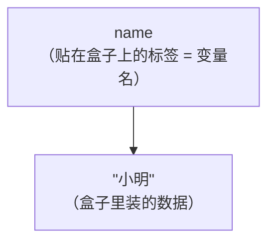

# 2.1 变量与数据类型

从这一节开始正式学语法。别紧张，我们会讲得很慢，每一步都有解释。

## 先想一个问题：为什么需要变量

上一章你已经会用 `print()` 了。假设要打印一段自我介绍：

```python live_py slim
print("大家好，我是小明")
print("小明今年 18 岁")
print("请多关照小明")
```

名字"小明"出现了 3 次。如果哪天想改成"小红"，就得改 3 个地方，漏改一个就出 bug。

要是能**把名字先存起来，起个代号，后面都用代号**，改的时候只改一处就好了。这就是变量干的事：

```py live_py title=我的第一个变量
name = "小明"

print("大家好，我是" + name)
print(name + "今年 18 岁")
print("请多关照" + name)
```

现在想换人，只改第一行 `name = "小红"`，下面三行一个字都不用动。不信？上面这个代码块是可以直接编辑运行的——改改看，点右上角的▶ 运行按钮。

> 💡 这里的 `+` 用在两段文本之间表示"拼接"，把它们连成一句话，下一节会细讲。

## 什么是变量

**变量就是给数据起的名字。** 你可以把它想象成一个贴了标签的盒子：



程序运行时，数据存在电脑内存里。内存里的位置人记不住，所以我们给它贴个标签，以后喊名字就能拿到数据。

## 创建变量：赋值语句

创建变量只需要一行代码，这行代码叫**赋值语句**：

```python
name = "小明"
```

把它拆开看，一共三部分：

| 组成 | `name` | `=` | `"小明"` |
|------|--------|-----|----------|
| 含义 | 变量名 | 赋值号 | 值 |

读法是：**把右边的值，存进左边这个名字里**。注意方向是**从右到左**。

> ⚠️ **`=` 不是"等于"！** 数学里 `x = 5` 是说 x 和 5 相等；Python 里 `x = 5` 是一个动作——"把 5 存进 x"。这是新手最需要扭转的观念，后面学到 `x = x + 1` 你就明白区别了。

多写几个感受一下：

```python
name = "小明"      # 存一段文本
age = 18           # 存一个数字
height = 1.75      # 存一个小数
```

`#` 后面的内容是**注释**——写给人看的说明，Python 会完全忽略它。好的注释能帮未来的你看懂现在的代码。

## 使用变量

存进去之后，在任何需要这个值的地方，直接写变量名就行：

```python live_py title=使用变量
name = "小明"
age = 18

print(name)        # 输出：小明
print(age)         # 输出：18
```

运行到 `print(name)` 时，Python 看到 `name`，就去找这个盒子，取出里面的 `"小明"` 打印出来。

> ⚠️ **高频坑：`print(name)` 和 `print("name")` 完全不同！**
>
> ```python
> name = "小明"
> print(name)      # 输出：小明   ← 没引号，是变量，取盒子里的值
> print("name")    # 输出：name   ← 有引号，是文本，原样打印
> ```
>
> 加了引号就是普通文本，Python 不会把它当变量。刚开始几乎人人都会在这里犯一次错。

还有一条铁规矩：**变量必须先创建，后使用**。用一个从没赋过值的名字，程序会报错：

```python
print(score)   # ❌ NameError: name 'score' is not defined
```

`NameError` 的意思是"这个名字不存在"。看到它，先检查变量名是不是拼错了，或者是不是忘了赋值。

## 变量是可以变的

变量之所以叫"变"量，因为盒子里的东西可以随时换：

```py live_py slim
age = 18
print(age)   # 18

age = 19     # 把盒子里的 18 扔掉，放进 19
print(age)   # 19
```

**新值会把旧值覆盖掉**，旧值就没了。程序自上而下执行，任何时刻变量里只有"最后一次赋的值"。

再看一个重要的例子——把一个变量赋给另一个变量：

```py live_py slim
a = 10
b = a        # 把 a 此刻的值（10）复制一份给 b
a = 20       # a 换成 20，跟 b 没关系
print(a)     # 20
print(b)     # 10
```

关键在第 2 行：`b = a` 复制的是 a **当时**的值，不是把两个盒子绑在一起。之后 a 怎么变，b 都不受影响。

## 变量的命名规则

名字不能乱起。分两个层次：**必须遵守的**（违反直接报错）和**建议遵守的**（违反不报错，但不专业）。

**必须遵守：**

1. 只能用**字母、数字、下划线 `_`**，不能有空格、横杠、其他符号
2. **不能以数字开头**
3. 不能用 Python 的**保留字**（语言自己占用的词，如 `if`、`for`、`while`、`class` 等，写代码时编辑器会把它们显示成特殊颜色）

```python
user_name = "小红"    # ✅ 合法
name2 = "小红"        # ✅ 合法，数字不在开头就行
2name = "小红"        # ❌ SyntaxError：数字开头
user-name = "小红"    # ❌ SyntaxError：不能用横杠
user name = "小红"    # ❌ SyntaxError：不能有空格
if = 5                # ❌ SyntaxError：if 是保留字
```

**建议遵守（Python 社区的习惯）：**

- 用**有含义的英文单词**：`price` 好过 `p`，`user_name` 好过 `a1`。变量多了以后，名字就是最好的注释
- 多个单词用下划线连接，全小写：`total_price`、`is_finished`（这叫蛇形命名法，是 Python 的官方风格）

另外注意，Python **区分大小写**：`name`、`Name`、`NAME` 是三个互不相干的变量。手滑打错大小写，得到的就是 `NameError`。

> ⚠️ 还有一个隐蔽的坑：**别用 `print`、`type` 这类内置函数名当变量名**。比如写了 `print = 5`，语法上不报错，但之后 `print("你好")` 就用不了了——名字被你占了。真遇到了，删掉那行重新运行即可。

## 数据是有类型的

盒子里能装的东西不止一种：文本、整数、小数……Python 把它们分成不同的**数据类型**。先掌握最常用的四种：

| 类型 | 英文名 | 例子 | 说明 |
|------|--------|------|------|
| 整数 | int | `18`、`-5`、`0` | 没有小数点的数 |
| 浮点数 | float | `3.14`、`-0.5`、`1.0` | 带小数点的数 |
| 字符串 | str | `"你好"`、`'abc'`、`"18"` | 文本，用引号包起来 |
| 布尔值 | bool | `True`、`False` | 只有"真/假"两个值 |

```python
age = 18            # int：年龄是整数
height = 1.75       # float：身高有小数
name = "小明"       # str：名字是文本
is_student = True   # bool：是不是学生，真或假
```

逐个说几句：

- **int 和 float**：数学里 18 和 18.0 是一个数，但在 Python 里 `18` 是 int、`18.0` 是 float，是两种类型。日常计算不用刻意区分，混着算也没问题。
- **str（字符串）**：只要被引号包住的都是字符串。单引号 `'你好'` 和双引号 `"你好"` 完全等价，选一种用顺手就行（本教程统一用双引号）。
- **bool（布尔值）**：只有 `True` 和 `False` 两个值，**首字母必须大写**（写 `true` 会报 NameError）。现在觉得它没用没关系，下一章学 if 判断时它就是主角。

### 用 type() 查看类型

不确定一个值是什么类型？用 `type()` 问 Python：

```python live_py title=查看类型
print(type(18))        # <class 'int'>
print(type(1.75))      # <class 'float'>
print(type("你好"))    # <class 'str'>
print(type(True))      # <class 'bool'>
```

输出里 `<class 'int'>` 的意思就是"这是 int 类型"。

### 重点：18 和 "18" 不是一回事

这是本节最重要的一个坑，值得单独做个实验：

```python live_py title=数字与字符串
a = 18       # 数字 18
b = "18"     # 文本 "18"（虽然长得像数字，但它是字符串！）

print(type(a))    # <class 'int'>
print(type(b))    # <class 'str'>

print(a + a)      # 36     ← 数字相加，做数学运算
print(b + b)      # 1818   ← 字符串相加，是拼接！
```

看到区别了吗？**加了引号，就是文本**，哪怕内容全是数字。数字能做数学运算，字符串的 `+` 只会把两段文本接在一起。

更进一步，数字和字符串直接相加会报错：

```python
print(a + b)   # ❌ TypeError: unsupported operand type(s) for +: 'int' and 'str'
```

`TypeError` 意思是"类型不对，这两种类型没法做这个运算"。那如果确实需要把数字和文本拼在一起呢？往下看。

## 类型转换

Python 提供了三个函数，可以在类型之间转换，名字就是类型名：

| 函数 | 作用 | 例子 |
|------|------|------|
| `int(x)` | 把 x 转成整数 | `int("18")` → `18` |
| `float(x)` | 把 x 转成浮点数 | `float("3.5")` → `3.5` |
| `str(x)` | 把 x 转成字符串 | `str(18)` → `"18"` |

**场景一：字符串转数字，用来计算**

```python live_py slim
num = int("18")     # "18" → 18
print(num + 1)      # 19，转成数字后就能做数学运算了
```

（这个场景以后会天天遇到：2.4 节你会学到，用户从键盘输入的内容永远是字符串，想拿来计算就必须先转换。）

**场景二：数字转字符串，用来拼接**

```python live_py slim
age = 18
print("我今年" + str(age) + "岁")   # 我今年18岁
```

刚才 `数字 + 字符串` 会报 TypeError，把数字用 `str()` 转成字符串后，就能顺利拼接了。

**转换失败会报错：**

```python
int("abc")    # ❌ ValueError：'abc' 根本不是数字，转不了
int("3.5")    # ❌ ValueError：int() 不接受带小数点的字符串
```

`ValueError` 意思是"类型对了但值不行"。想把 `"3.5"` 变成数字，应该用 `float("3.5")`。

## 本节报错速查

这一节出现了 4 种报错，都是以后的常客，混个脸熟：

| 报错 | 人话翻译 | 常见原因 |
|------|----------|----------|
| `SyntaxError` | 语法写错了 | 变量名不合法、用了中文标点 |
| `NameError` | 这个名字不存在 | 变量没赋值就用、拼错大小写、`true` 没大写 |
| `TypeError` | 类型不对 | 数字和字符串直接相加 |
| `ValueError` | 值不对 | `int("abc")` 这类转不了的转换 |

## 练习

动手是学会的唯一方式。建议新建 `practice21.py` 逐题完成。

**1.** 创建 4 个变量：你的姓名、年龄、身高、是否喜欢编程（分别用 str、int、float、bool 类型），然后用 4 行 `print()` 逐个打印。

**2.** 不运行代码，先猜下面每行输出什么，再运行验证：

```python live_py title=猜输出练习
x = 5
y = x
x = 100
print(y)

print("x")

print(type("3.14"))
```

**3.** 下面这段代码想输出"小狗今年3岁"，但会报错。找出原因并修好它：

```python live_py title=修bug练习
dog_age = 3
print("小狗今年" + dog_age + "岁")
```

<details>
<summary>点击查看答案</summary>

**第 2 题：**
- `print(y)` 输出 `5`。`y = x` 复制的是 x 当时的值 5，后面 x 改成 100 与 y 无关。
- `print("x")` 输出 `x`。带引号是文本，原样打印，不是变量。
- `print(type("3.14"))` 输出 `<class 'str'>`。带引号就是字符串，长得像小数也没用。

**第 3 题：** 报 `TypeError`，因为字符串不能和数字直接相加。把数字转成字符串即可：

```python
dog_age = 3
print("小狗今年" + str(dog_age) + "岁")
```

</details>

## 本章小结

- 变量是给数据起的名字，作用是**存起来、反复用、改一处生效**
- `=` 是赋值不是等于：把右边的值存进左边的名字，方向从右到左
- 变量先赋值后使用；新值覆盖旧值；`b = a` 只是复制当时的值
- 命名：字母/数字/下划线，不能数字开头，区分大小写；推荐 `user_name` 这种小写下划线风格
- 四种基本类型：int、float、str、bool；`type()` 查看类型
- **`18` 是数字，`"18"` 是字符串**，行为完全不同；用 `int()`/`float()`/`str()` 互相转换

下一节：[2.2 数字与运算符](02-数字与运算符.md)
