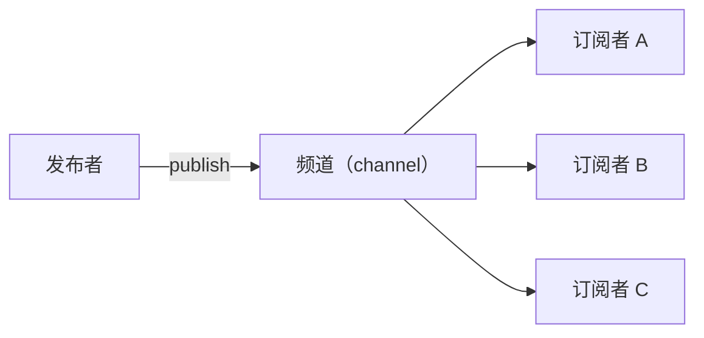

# 3.4 发布订阅（Pub/Sub）

> 发布订阅是 Redis 的"广播电台"功能：发布者往频道里喊一嗓子，所有订阅了该频道的客户端同时收到。
> 本章内容简单，10 分钟学完。

## 1. 模型



- **频道（channel）** 不需要预先创建，发布/订阅时自动存在
- 一条消息会被**所有**订阅者收到（对比 List 队列：一条消息只能被一个消费者抢到）
- 消息**不存储**：发布时不在线的订阅者永远收不到这条消息（像广播，错过就是错过）

## 2. 动手体验（需要开两个终端）

**终端 1（订阅者）**：

```
127.0.0.1:6379> subscribe news
Reading messages... (press Ctrl-C to quit)
1) "subscribe"
2) "news"
3) (integer) 1
（进入等待状态...）
```

**终端 2（发布者）**：

```
127.0.0.1:6379> publish news "Redis 7 发布了！"
(integer) 1        # 返回值 = 收到消息的订阅者数量
```

回到终端 1，会看到消息实时到达：

```
1) "message"
2) "news"
3) "Redis 7 发布了！"
```

## 3. 模式订阅：用通配符一次订阅一批频道

```
# 订阅所有 news. 开头的频道
127.0.0.1:6379> psubscribe news.*

# 另一个终端发布
127.0.0.1:6379> publish news.sports "比赛开始"
127.0.0.1:6379> publish news.tech "新手机发布"
# 两条都能收到
```

## 4. 命令小结

| 命令 | 作用 |
|------|------|
| `subscribe ch1 [ch2 ...]` | 订阅频道 |
| `publish ch message` | 向频道发布消息 |
| `psubscribe news.*` | 按模式（通配符）订阅 |
| `unsubscribe` / `punsubscribe` | 取消订阅 |
| `pubsub channels` | 查看当前有订阅者的频道 |

## 5. 适用场景与局限

**适合**：

- 实时通知：配置变更广播、缓存失效通知（通知所有服务节点清理本地缓存）
- 简单的聊天室、弹幕原型
- 系统内部的轻量事件广播

**局限（重要）**：

- **消息不持久化**：订阅者掉线期间的消息全部丢失
- **没有 ACK**：不保证消息被处理
- 订阅者处理太慢时消息可能被丢弃

一句话定位：**Pub/Sub 适合"丢了也无所谓"的实时通知**。需要可靠投递就用 Stream 或专业消息队列。

> 💡 补充：Redis 有个实用功能叫"键空间通知（keyspace notification）"，可以在 key 过期时向 `__keyevent@0__:expired` 频道发消息，常被用来做"订单 30 分钟未支付自动取消"的简易方案（需在配置中开启 `notify-keyspace-events Ex`）。了解即可。

## 6. 动手练习

1. 开两个终端，完成一次最基本的发布订阅
2. 再开第三个终端也订阅同一频道，验证"一条消息所有订阅者都收到"
3. 关闭订阅者终端，发布一条消息，再重新订阅——验证消息确实收不到了（不存储）

---

核心机制篇完结！接下来学以致用，写代码 👉 [4.1 用代码操作 Redis](../04-实战篇/01-用代码操作Redis.md)
