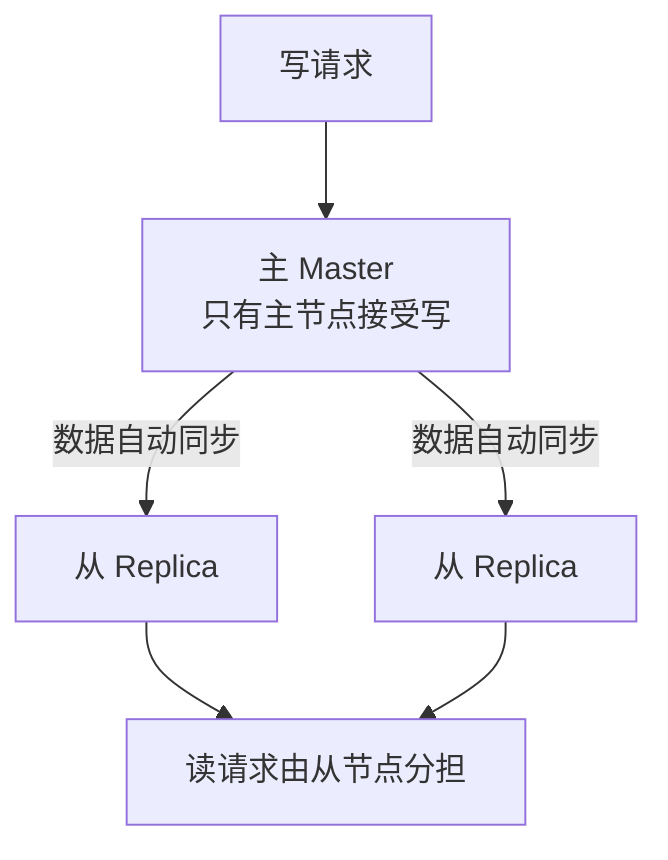

# 5.1 主从复制

> 从这一章开始进入进阶篇：单台 Redis 不够用了怎么办？
> 第一步是主从复制——把数据自动同步到多台机器上。新手以**理解概念**为主，动手实验可选。

## 1. 为什么需要主从

单台 Redis 有两个致命问题：

1. **单点故障**：这台机器挂了，缓存全没，服务瘫痪
2. **读性能有上限**：一台机器的 QPS 再高也有极限，而多数业务读远多于写

主从复制（Replication）解决思路：



- **主节点（master）**：负责写，数据变更自动同步给所有从节点
- **从节点（replica/slave）**：默认只读，分担读流量；同时是天然的热备份

这就是**读写分离**：写走主，读走从。

## 2. 怎么搭建（简单到超乎想象）

让一台 Redis 成为另一台的从节点，只需一条命令或一行配置：

```
# 方式一：命令（在从节点上执行）
127.0.0.1:6380> replicaof 127.0.0.1 6379

# 方式二：配置文件
replicaof 127.0.0.1 6379

# 取消复制，恢复独立身份
127.0.0.1:6380> replicaof no one
```

### 本机动手实验（可选）

用 Docker 快速体验：

```bash
# 启动主节点
docker run -d --name redis-master -p 6379:6379 redis:7

# 启动从节点，启动时直接指定主节点
docker run -d --name redis-replica -p 6380:6379 \
  redis:7 redis-server --replicaof host.docker.internal 6379

# 验证：主节点写入
docker exec -it redis-master redis-cli set hello world

# 从节点能读到
docker exec -it redis-replica redis-cli get hello     # → "world"

# 从节点默认拒绝写入
docker exec -it redis-replica redis-cli set foo bar
# (error) READONLY You can't write against a read only replica.
```

查看复制状态：

```
127.0.0.1:6379> info replication
role:master
connected_slaves:1
slave0:ip=...,port=6380,state=online,...
```

## 3. 复制的原理（面试简答版）

### 首次同步：全量复制

1. 从节点连上主节点，请求同步
2. 主节点执行 `bgsave` 生成 RDB 快照，发给从节点
3. 从节点清空自己的数据，加载这份 RDB
4. RDB 生成期间的新写命令，主节点存在缓冲区里，随后补发给从节点

### 日常同步：增量传播

全量同步完成后，主节点每执行一条写命令，就实时转发给所有从节点。

### 断线重连：部分重同步

从节点短暂掉线重连后，不需要重来一遍全量。主节点维护一个**复制积压缓冲区**（环形缓冲区，记录最近的写命令），从节点带着自己的复制偏移量（offset）来续传，缺的部分补上即可。只有掉线太久、缓冲区装不下缺口时，才退化为全量复制。

> 💡 记住三个关键词就够了：**全量复制（RDB）→ 命令传播 → 部分重同步（offset + 积压缓冲区）**。

## 4. 主从复制的局限

1. **主节点挂了不会自动切换**——需要人工把某个从节点提升为主（`replicaof no one`），再让其他从节点指向它。半夜挂了运维哭晕
2. **复制是异步的**：主节点写完立刻返回，不等从节点确认。极端情况下主节点刚写完就宕机，这条数据可能没来得及同步，从节点提升为主后数据就丢了
3. 写能力和内存容量仍受限于主节点单机

第 1 个问题由**哨兵**解决（下一章），第 3 个问题由**集群**解决（下下章）。

## 5. 小结

- 主从 = **一主多从、读写分离、异步复制**
- 一条 `replicaof` 命令即可组建
- 首次全量复制（RDB），之后实时命令传播，断线用 offset 部分重同步
- 主要短板：**主挂了不能自动切换** → 引出哨兵

---

下一章：让主从切换全自动 👉 [5.2 哨兵 Sentinel](02-哨兵Sentinel.md)
