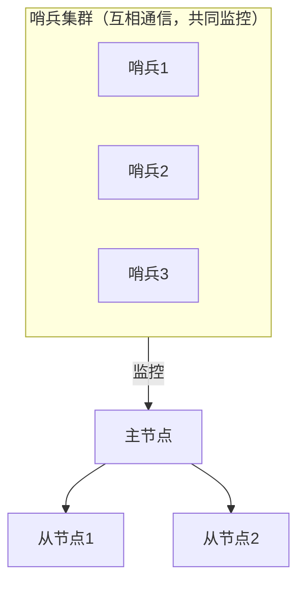

# 5.2 哨兵 Sentinel

> 主从复制解决了备份和读扩展，但"主挂了要人工切换"是硬伤。**哨兵**就是那个 7×24 小时替你盯着、并自动完成切换的值班员。
> 本章以理解概念为主。

## 1. 哨兵是什么

哨兵（Sentinel）是**独立运行的特殊 Redis 进程**，它不存业务数据，专职做四件事：

1. **监控**：不停地 ping 主节点和从节点，检查是否存活
2. **自动故障转移**：确认主节点挂了后，自动从从节点中选一个提升为新主，并让其他从节点改认新主
3. **通知客户端**：客户端连接哨兵询问"现在谁是主节点"，切换后自动感知
4. **配置提供者**：充当客户端的服务发现入口

架构长这样（生产标准配置：3 个哨兵 + 1 主 2 从）：



## 2. 为什么哨兵要部署 3 个（奇数个）？

如果只有 1 个哨兵，它自己的网络抖一下，就会误判"主节点挂了"而乱切换。所以需要**多个哨兵投票**：

- **主观下线（SDOWN）**：某一个哨兵 ping 不通主节点，它"个人认为"主挂了
- **客观下线（ODOWN）**：达到 `quorum`（法定人数，通常配 2）个哨兵都认为主挂了，才正式认定故障
- 随后哨兵之间**选举出一个领头哨兵**（Raft 算法思想），由它执行故障转移

部署奇数个（至少 3 个）是为了投票能形成多数派、避免平票。

## 3. 故障转移的完整流程

1. 主节点宕机
2. 各哨兵陆续发现 ping 不通 → 主观下线
3. 达到 quorum 个哨兵同意 → 客观下线
4. 哨兵选举出领头哨兵
5. 领头哨兵挑选新主节点，优先级规则大致为：
   - 配置的优先级（`replica-priority`）高的优先
   - 复制偏移量最大的优先（**数据最全的**）
   - runid 最小的兜底
6. 对选中的从节点执行 `replicaof no one`，升级为主
7. 通知其余从节点 `replicaof 新主`
8. 旧主恢复后，自动降级为新主的从节点

整个过程通常几秒到几十秒，**期间写请求会失败**，客户端要有重试机制。

## 4. 最小配置示例（了解即可）

每个哨兵一份 `sentinel.conf`：

```conf
port 26379
# 监控名为 mymaster 的主节点，quorum = 2
sentinel monitor mymaster 127.0.0.1 6379 2
# ping 不通 30 秒判定主观下线
sentinel down-after-milliseconds mymaster 30000
# 故障转移超时
sentinel failover-timeout mymaster 180000
```

启动：

```bash
redis-sentinel sentinel.conf
```

客户端连接方式也变了——**连哨兵而不是直连主节点**（以 Python 为例）：

```python
from redis.sentinel import Sentinel

sentinel = Sentinel([("h1", 26379), ("h2", 26379), ("h3", 26379)])
master = sentinel.master_for("mymaster")   # 自动发现当前主节点
replica = sentinel.slave_for("mymaster")   # 自动发现从节点

master.set("k", "v")     # 写走主
replica.get("k")         # 读走从
# 主从切换后，sentinel 客户端会自动连上新主，业务代码无感
```

## 5. 哨兵模式的局限

哨兵解决了**高可用**（自动切换），但没解决：

- **写性能瓶颈**：还是只有一个主节点在写
- **容量瓶颈**：数据总量不能超过单机内存

数据量大到一台机器装不下时，就需要最后一块拼图——**集群（Cluster）**。

## 6. 小结

- 哨兵 = 监控 + 自动故障转移 + 客户端服务发现
- 至少部署 **3 个**哨兵，靠**投票（quorum）**避免误判：主观下线 → 客观下线 → 选领头 → 切换
- 新主的选择偏向**数据最全**的从节点
- 客户端连哨兵，切换无感知
- 哨兵不解决写性能和容量问题 → 引出集群

---

下一章：数据分片，突破单机极限 👉 [5.3 集群 Cluster](03-集群Cluster.md)
