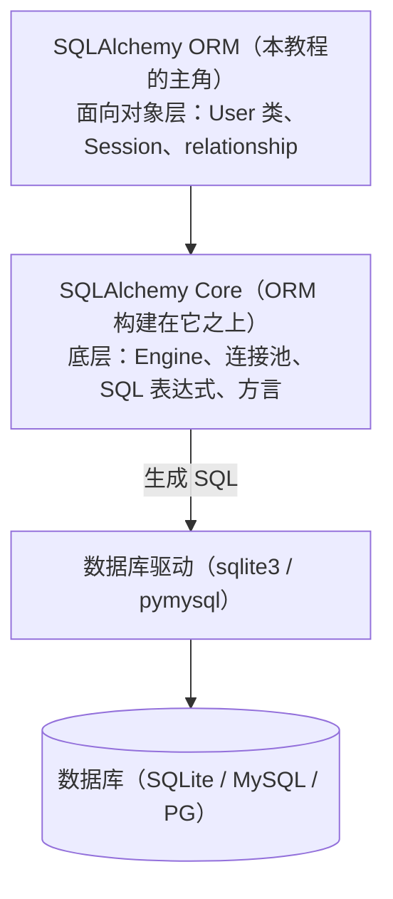
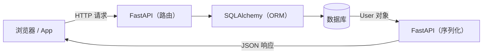

# 1.1 什么是数据库、SQL 和 ORM

> 本节没有任何代码，但它回答了三个最重要的问题：**数据存在哪？怎么存取？SQLAlchemy 是干什么的？**
> 搞懂这三个问题，后面的学习会顺利十倍。

## 一、程序的数据存在哪里？

假设你写了一个记账程序，用户记了一笔账：

```python
record = {"date": "2026-07-26", "item": "午饭", "amount": 25.5}
```

这个 `record` 存在**内存**里。程序一关闭，数据就没了。

怎么办？最朴素的想法是**存到文件里**（比如 JSON 文件）。这在数据量小的时候确实可行，但很快你会遇到麻烦：

- 想查"7月份所有超过100元的支出"？你得把整个文件读进内存自己遍历。
- 两个程序同时写同一个文件？数据会互相覆盖、损坏。
- 数据有 100 万条？每次读写整个文件慢到无法接受。

**数据库（Database）** 就是为了解决这些问题而生的专业软件。它帮你：

- ✅ 把数据**持久化**保存到硬盘
- ✅ 提供**高效的查询**能力（百万条数据中瞬间找到目标）
- ✅ 处理**并发**（多个程序同时读写不出乱子）
- ✅ 保证**数据安全**（断电也不会存一半丢一半）

## 二、关系型数据库：用"表格"存数据

数据库有很多种，最主流的一类叫**关系型数据库**，常见的有：

| 数据库 | 特点 | 适用场景 |
|--------|------|---------|
| **SQLite** | 单文件、零配置、Python 自带 | 学习、小工具、手机 App |
| **MySQL** | 最流行的开源数据库 | 各类网站、中小企业 |
| **PostgreSQL** | 功能最强的开源数据库 | 复杂业务、大型项目 |
| SQL Server / Oracle | 商业数据库 | 传统企业 |

> 💡 本教程全程使用 **SQLite**，因为它不需要安装任何软件，Python 自带支持。而 SQLAlchemy 的一大好处就是：**代码写一遍，换数据库几乎不用改**。你学会了 SQLite 上的用法，将来切到 MySQL/PostgreSQL 只需改一行连接配置。

关系型数据库用**表（Table）**组织数据，就像 Excel 表格：

**users 表（用户表）**

| id | name | email | age |
|----|------|-------|-----|
| 1  | 张三 | zhangsan@qq.com | 25 |
| 2  | 李四 | lisi@qq.com | 30 |

几个术语（后面会天天见）：

- **表（Table）**：一类数据的集合，如"用户表"、"订单表"
- **行（Row）/ 记录（Record）**：表中的一条数据，如"张三这个用户"
- **列（Column）/ 字段（Field）**：数据的一个属性，如"name"、"email"
- **主键（Primary Key）**：唯一标识一行的字段，通常是自增的 `id`
- **外键（Foreign Key）**：指向另一张表主键的字段，用来表达"关系"（第4章详讲）

## 三、SQL：和数据库对话的语言

数据库不懂 Python，它只听得懂一种叫 **SQL**（Structured Query Language，结构化查询语言）的语言。比如：

```sql
-- 查询所有年龄大于 20 的用户
SELECT * FROM users WHERE age > 20;

-- 插入一条新用户
INSERT INTO users (name, email, age) VALUES ('王五', 'wangwu@qq.com', 28);

-- 更新用户信息
UPDATE users SET age = 26 WHERE name = '张三';

-- 删除用户
DELETE FROM users WHERE id = 2;
```

这四种操作合称 **CRUD**：

- **C**reate（增）→ `INSERT`
- **R**ead（查）→ `SELECT`
- **U**pdate（改）→ `UPDATE`
- **D**elete（删）→ `DELETE`

日常后端开发 80% 的数据库工作就是这四件事。

> ❓ **我需要先精通 SQL 才能学 SQLAlchemy 吗？**
> 不需要。了解上面这几句的意思就够入门了。但随着深入，懂一些 SQL 会让你调试起来更轻松——本教程会在关键处展示 SQLAlchemy 代码对应生成的 SQL，帮你顺便把 SQL 也看懂。

## 四、ORM：让你用 Python 类操作数据库

在 Python 里直接写 SQL 是这样的（使用自带的 sqlite3 模块）：

```python
import sqlite3

conn = sqlite3.connect("app.db")
cursor = conn.cursor()
cursor.execute("SELECT * FROM users WHERE age > ?", (20,))
rows = cursor.fetchall()
# rows 是一堆元组: [(1, '张三', 'zhangsan@qq.com', 25), ...]
name = rows[0][1]   # 想取名字？得记住 name 是第 2 列……
```

痛点很明显：

1. **SQL 是字符串**——写错了 IDE 不报错，运行时才炸
2. **结果是元组**——`rows[0][1]` 这种下标访问既难读又易错
3. **换数据库要改 SQL**——各家数据库的 SQL 方言有差异
4. **手动拼 SQL 有安全风险**——容易引入 SQL 注入漏洞

**ORM（Object Relational Mapping，对象关系映射）** 的思路是：**把表映射成类，把行映射成对象，把字段映射成属性**。

| 数据库世界 | Python 世界 |
|-----------|------------|
| 表 users | 类 `User` |
| 一行记录 | 一个 `User` 对象 |
| 字段 name | 属性 `user.name` |
| SQL 语句 | 方法调用 / 表达式 |

同样的查询，用 SQLAlchemy（ORM）写：

```python
stmt = select(User).where(User.age > 20)
users = session.scalars(stmt).all()
# users 是一堆 User 对象
name = users[0].name   # 直接用属性访问，清晰！
```

SQLAlchemy 会在幕后自动生成 SQL、执行、再把结果打包成 `User` 对象还给你。

## 五、SQLAlchemy 是什么？

**SQLAlchemy 是 Python 世界最流行、最强大的数据库工具包和 ORM**，诞生于 2006 年，至今仍在活跃更新。FastAPI、Flask 等主流 Web 框架的教程里，数据库部分几乎默认使用它。

它其实分为两层，理解这一点对后续学习很重要：



- **Core**：负责连接数据库、管理连接池、构建 SQL。你会接触到它的 `create_engine`、`text()` 等。
- **ORM**：建立在 Core 之上，提供类映射、Session、关系管理。日常开发主要用这层。

> 📌 **关于版本**：SQLAlchemy 2.0（2023年发布）对 API 做了重大现代化改进。本教程全程使用 2.0 语法。如果你在网上看到 `session.query(User).filter(...)` 这种写法，那是 1.x 老语法——能用，但不推荐新项目使用。

## 六、本教程的终点：FastAPI + SQLAlchemy

学 ORM 的最终目的通常是**写 Web 后端**：前端/App 发来 HTTP 请求，后端查数据库、返回 JSON。

**FastAPI** 是目前最热门的 Python Web 框架：性能高、写法现代、自动生成接口文档。它和 SQLAlchemy 是当下 Python 后端最主流的组合之一：



第 6、7 章我们会完整实现这条链路。

## 📝 本节小结

| 概念 | 一句话解释 |
|------|-----------|
| 数据库 | 专业存数据的软件，解决持久化、查询、并发问题 |
| 关系型数据库 | 用表格（行×列）组织数据的数据库 |
| SQL | 操作关系型数据库的专用语言 |
| CRUD | 增删改查四种基本操作 |
| ORM | 把表/行/字段映射为类/对象/属性的技术 |
| SQLAlchemy | Python 最强 ORM，分 Core 和 ORM 两层 |
| FastAPI | 现代 Python Web 框架，和 SQLAlchemy 是黄金搭档 |

下一节我们动手搭环境 → [1.2 环境搭建与安装](02-环境搭建与安装.md)
