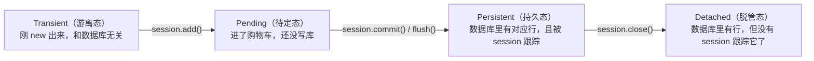

# 2.3 Session：与数据库对话的窗口

> Session 是 ORM 世界里你打交道最多的对象——所有增删改查都经过它。它也是新手最容易犯迷糊的地方。本节把它的工作机制讲透。

## 一、Session 是什么？

可以把 Session 想象成一个**购物车 + 记账本**：

- 你把新对象 `add` 进来（放进购物车）
- 你修改已有对象的属性（记账本记下改动）
- 最后 `commit()` 一次性结算（把所有改动打包发给数据库）

```python
from sqlalchemy.orm import Session

with Session(engine) as session:
    user = User(name="张三", email="zs@example.com", age=25)
    session.add(user)      # 放入购物车（数据库还没变！）
    session.commit()       # 结算（此刻才真正执行 INSERT）
```

## 二、两种创建方式

### 方式一：直接创建（脚本、简单场景）

```python
from sqlalchemy.orm import Session

with Session(engine) as session:
    ...
```

### 方式二：sessionmaker 工厂（正式项目标准做法）

```python
from sqlalchemy.orm import sessionmaker

# 程序启动时创建一次"会话工厂"
SessionLocal = sessionmaker(bind=engine)

# 之后随处使用工厂生产会话
with SessionLocal() as session:
    ...
```

`sessionmaker` 的好处是把配置（绑定哪个 engine 等）集中在一处。**FastAPI 项目里用的就是这种方式**（第 6 章见）。

> 📌 与 Engine 相反：**Engine 全局只要一个，而 Session 用完就扔**——每个请求/每个任务单元创建一个新 Session，短暂使用后关闭。千万不要搞一个全局 Session 到处用（并发时会出大乱子）。

## 三、核心方法总览

| 方法 | 作用 |
|------|------|
| `session.add(obj)` | 登记一个新对象（待插入） |
| `session.add_all([obj, ...])` | 批量登记 |
| `session.get(User, 主键)` | 按主键查一个对象 |
| `session.execute(stmt)` | 执行查询/更新语句，返回 Result |
| `session.scalars(stmt)` | 执行查询，直接返回对象序列（最常用） |
| `session.delete(obj)` | 登记删除 |
| `session.commit()` | 提交：把所有待办真正写入数据库 |
| `session.rollback()` | 回滚：撤销本次事务的所有未提交改动 |
| `session.refresh(obj)` | 从数据库重新加载该对象的最新数据 |
| `session.flush()` | 把待办 SQL 发给数据库执行，但**不提交**事务 |
| `session.close()` | 关闭会话（with 语法会自动调用） |

## 四、关键机制：改对象属性 = 自动记账

Session 有个"魔法"：**从它查出来的对象，你直接改属性，它自己就知道**，commit 时会自动生成 UPDATE。

```python
with Session(engine) as session:
    user = session.get(User, 1)     # 查出 id=1 的用户
    user.age = 26                   # 直接改属性——Session 已悄悄记下这笔账
    session.commit()                # 自动执行 UPDATE users SET age=26 WHERE id=1
```

不需要什么 `session.update(user)`（根本没有这个方法）。这个机制叫**脏数据追踪（dirty tracking）**。

## 五、对象的四种状态（理解 Session 的钥匙）

一个模型对象相对于 Session 有四种状态：



```python
user = User(name="张三", age=25)   # Transient：纯内存对象
print(user.id)                     # None

with Session(engine) as session:
    session.add(user)              # Pending：已登记，未入库
    session.commit()               # Persistent：已入库
    print(user.id)                 # 1  ← commit 后自动拿到数据库分配的主键！

# with 结束，session 关闭
print(user.name)                   # Detached：仍可读到已加载的属性
```

### 新手最常撞的坑：Detached 对象

```python
with Session(engine) as session:
    user = session.get(User, 1)

# session 已关闭
print(user.posts)   # ❌ 可能报错 DetachedInstanceError！
```

为什么？`user.posts` 这类**关系属性是懒加载的**——访问时才去查数据库，而此时 Session 已经关了，没法查了。解决办法在 [4.4 关系加载策略与 N+1 问题](../04-表关系/04-关系加载策略.md) 详讲。现在先记住现象：**尽量在 Session 存活期间用完对象**。

## 六、commit / rollback / flush 深入理解

### commit：提交事务

```python
session.commit()
```

做了三件事：① 把所有待办 SQL 发给数据库（即 flush）② 提交事务，改动永久生效 ③ 让所有对象过期（下次访问属性时自动重新查询，保证拿到最新值）。

### rollback：出错时回滚

```python
with Session(engine) as session:
    try:
        session.add(user1)
        session.add(user2)          # 假设这条违反唯一约束
        session.commit()
    except Exception:
        session.rollback()          # user1、user2 都不会入库——要么全成，要么全不成
        raise
```

这就是**事务（Transaction）**：一组操作作为整体成败。详见 [5.2 事务处理](../05-进阶主题/02-事务处理.md)。

### 更优雅的写法：session.begin()

```python
with Session(engine) as session:
    with session.begin():       # 块结束自动 commit；有异常自动 rollback
        session.add(user1)
        session.add(user2)
```

### flush：发送但不提交

`flush` 把 SQL 发到数据库执行（比如让新对象拿到自增 id），但事务还没提交，随时可回滚：

```python
with Session(engine) as session:
    user = User(name="张三", email="zs@example.com", age=25)
    session.add(user)
    session.flush()          # 执行 INSERT，但未提交
    print(user.id)           # 1 ← 已经拿到 id 了
    session.rollback()       # 反悔！这条 INSERT 被撤销
```

典型用途：先拿到主对象的 id，再用这个 id 创建关联对象，最后一起 commit。

## 七、session.get()：按主键查询的捷径

```python
user = session.get(User, 1)       # 按主键查，查不到返回 None
if user is None:
    print("用户不存在")
```

它还有一层缓存优化：如果这个对象**本次会话已经加载过**，`get` 直接返回内存中的对象，不再查库（这块缓存叫 **Identity Map**，同一个 Session 内，同一行数据永远只对应同一个 Python 对象）。

## 八、标准使用模式总结

**脚本模式**（本教程前几章使用）：

```python
with Session(engine) as session:
    # ...增删改查...
    session.commit()
```

**事务块模式**（推荐，异常自动回滚）：

```python
with Session(engine) as session, session.begin():
    ...   # 结束自动 commit，异常自动 rollback
```

**Web 应用模式**（第 6 章 FastAPI 会用依赖注入实现）：

```
请求到达 → 创建 session → 处理业务 → commit → 关闭 session → 返回响应
                                └── 出异常 → rollback → 关闭 session
```

## 📝 本节小结

- Session = 购物车 + 记账本：`add`/属性修改只是登记，`commit` 才落库
- Engine 全局一个；**Session 短命多个**，用完即关
- 查出来的对象改属性会被自动追踪，commit 时自动 UPDATE
- 四种状态：Transient → Pending → Persistent → Detached
- `commit` 提交事务；`rollback` 回滚；`flush` 发送 SQL 但不提交
- `session.get(User, id)` 是按主键查询的最快方式

下一节，认识更多字段类型 → [2.4 常用字段类型与列参数](04-字段类型与列参数.md)
