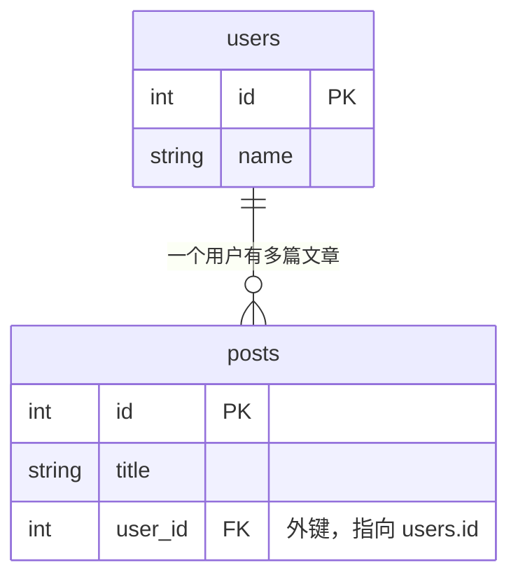

# 4.1 一对多关系

> 表关系是关系型数据库的灵魂，也是 ORM 最能体现价值的地方。本节从最常见的**一对多**（一个用户 → 多篇文章）讲起，搞懂外键和 `relationship` 的分工。

## 一、为什么需要关系？

需求：用户可以发表多篇文章。如果把作者信息直接塞进文章表：

| id | title | author_name | author_email |
|----|-------|-------------|--------------|
| 1  | 文章A | 张三 | zs@qq.com |
| 2  | 文章B | 张三 | zs@qq.com |
| 3  | 文章C | 李四 | ls@qq.com |

问题：张三的信息**重复存储**；张三改邮箱要改 N 行；一不小心两行数据不一致。

正确做法——**拆成两张表，用外键关联**：



用示例数据看更直观——posts 表的 `user_id` 指向 users 表的 `id`：

| users.id | name |     | posts.id | title | user_id |
|----------|------|-----|----------|-------|---------|
| 1 | 张三 |     | 1 | 文章A | **1** |
| 2 | 李四 |     | 2 | 文章B | **1** |
|   |      |     | 3 | 文章C | **2** |

**一**个用户对应**多**篇文章 = 一对多（One-to-Many）。关键点：**外键永远放在"多"的那一边**（posts 表存 user_id）。

## 二、SQLAlchemy 实现

```python
from sqlalchemy import ForeignKey, String, create_engine
from sqlalchemy.orm import (DeclarativeBase, Mapped, mapped_column,
                            relationship, sessionmaker)


class Base(DeclarativeBase):
    pass


class User(Base):
    __tablename__ = "users"

    id: Mapped[int] = mapped_column(primary_key=True)
    name: Mapped[str] = mapped_column(String(50))

    # 关系属性："一"方持有一个列表，装着它的所有文章
    posts: Mapped[list["Post"]] = relationship(back_populates="author")

    def __repr__(self) -> str:
        return f"User(id={self.id}, name={self.name!r})"


class Post(Base):
    __tablename__ = "posts"

    id: Mapped[int] = mapped_column(primary_key=True)
    title: Mapped[str] = mapped_column(String(200))

    # ① 外键列：真实存在于数据库的列，存作者的 id
    user_id: Mapped[int] = mapped_column(ForeignKey("users.id"), index=True)

    # ② 关系属性："多"方持有一个对象，指向它的作者
    author: Mapped["User"] = relationship(back_populates="posts")

    def __repr__(self) -> str:
        return f"Post(id={self.id}, title={self.title!r})"


engine = create_engine("sqlite:///rel.db", echo=True)
SessionLocal = sessionmaker(bind=engine)
Base.metadata.create_all(engine)
```

## 三、拆解三个关键零件

### ① 外键列：`ForeignKey("users.id")`

```python
user_id: Mapped[int] = mapped_column(ForeignKey("users.id"), index=True)
```

- 这是**数据库里真实存在的列**，存的是数字（作者的 id）
- `ForeignKey` 的参数是 **"表名.列名"**（小写表名！不是类名 `User.id` 的写法虽然也支持，但字符串形式最通用）
- 建议加 `index=True`——外键列查询频繁，但数据库不会自动为它建索引

### ② 关系属性：`relationship`

```python
# User 侧
posts: Mapped[list["Post"]] = relationship(back_populates="author")
# Post 侧
author: Mapped["User"] = relationship(back_populates="posts")
```

- `relationship` **不在数据库里占任何列**！它是纯 Python 层面的"便捷通道"，SQLAlchemy 靠外键自动推断两表怎么关联
- 类型注解决定方向：`Mapped[list["Post"]]` 表示"我有一堆 Post"；`Mapped["User"]` 表示"我属于一个 User"
- 类名加引号（`"Post"`）是因为定义 User 时 Post 类还没定义——这叫前向引用

### ③ `back_populates`：让两边保持同步

两侧的 `relationship` 通过 `back_populates` 互相指名字（我这边的属性 ←→ 你那边的属性）：

```python
user.posts.append(post)     # 从 user 侧添加
print(post.author)          # post 侧自动感知！→ User(id=1, name='张三')
```

改任何一边，另一边**内存中立即同步**，不需要等数据库。

> 📌 老代码里的 `backref="posts"` 是单边简写（自动生成另一侧属性）。2.0 推荐**两边显式写 `back_populates`**——代码更清晰，类型提示也完整。

## 四、使用：像操作普通对象一样操作关系

### 创建关联数据

```python
with SessionLocal() as session:
    # 方式1：先建用户，把文章 append 进去
    zhangsan = User(name="张三")
    zhangsan.posts.append(Post(title="我的第一篇博客"))
    zhangsan.posts.append(Post(title="SQLAlchemy 学习笔记"))
    session.add(zhangsan)          # 关联的 Post 会被"级联保存"，不用逐个 add！
    session.commit()

    # 方式2：建文章时直接指定作者对象
    lisi = User(name="李四")
    post = Post(title="今天天气不错", author=lisi)
    session.add(post)              # lisi 也会被一起保存
    session.commit()

    # 方式3：手上只有 id 时，直接设外键列
    p = Post(title="直接用id关联", user_id=zhangsan.id)
    session.add(p)
    session.commit()
```

注意方式1里**完全没有手动设置 user_id**——commit 时 SQLAlchemy 自动：先 INSERT 用户拿到 id，再把 id 填进每篇文章的 user_id。顺序和细节全帮你处理。

### 读取关联数据

```python
with SessionLocal() as session:
    user = session.get(User, 1)

    # 正向：用户 → 文章列表
    for post in user.posts:                    # 访问这一刻才发 SQL 查 posts（懒加载）
        print(f"{user.name} 写了《{post.title}》")

    # 反向：文章 → 作者
    post = session.get(Post, 1)
    print(f"《{post.title}》的作者是 {post.author.name}")
```

`user.posts` 平时不查库；**第一次访问它时**，SQLAlchemy 自动执行 `SELECT * FROM posts WHERE user_id = 1`。这叫**懒加载（lazy loading）**，方便但暗藏性能陷阱（N+1 问题），4.4 节专门讲。

### 按关系过滤查询

```python
from sqlalchemy import select

# 查张三的所有文章（join 写法，5.1 节详讲）
stmt = select(Post).join(Post.author).where(User.name == "张三")

# 查"发过文章"的用户
stmt = select(User).where(User.posts.any())

# 查"一篇都没发过"的用户
stmt = select(User).where(~User.posts.any())

# 查标题带"博客"的文章的作者
stmt = select(User).where(User.posts.any(Post.title.contains("博客")))
```

## 五、级联删除：删用户时文章怎么办？

默认情况下删除用户，其文章的 user_id 会被设为 NULL（如果列不允许 NULL 则报错）。通常我们想要"删用户连带删文章"：

```python
class User(Base):
    # ...
    posts: Mapped[list["Post"]] = relationship(
        back_populates="author",
        cascade="all, delete-orphan",   # 级联：删我时删掉我的文章
    )
```

- `"all, delete-orphan"`：删除用户 → 自动删除其所有文章；把某篇文章从 `user.posts` 里移除 → 该文章也被删除（成了"孤儿"）
- 这是"父子从属关系"（文章离开作者没有意义）的标准配置
- 如果是弱关联（如文章和标签），就**不要**配 delete-orphan

```python
with SessionLocal() as session:
    user = session.get(User, 1)
    session.delete(user)     # 张三和他的所有文章一起消失
    session.commit()
```

## 📝 本节小结

- 一对多 = "多"方放**外键列**（`ForeignKey("users.id")`），两侧放 **relationship**
- 外键列是真实数据；relationship 是 Python 层的便捷通道，不占数据库列
- `back_populates` 两边互指，内存中双向同步
- 添加关联对象后 add 父对象即可，级联保存自动处理外键赋值
- `user.posts` 是懒加载：访问时才查库
- 父子从属关系配 `cascade="all, delete-orphan"`

下一节 → [4.2 一对一关系](02-一对一关系.md)
