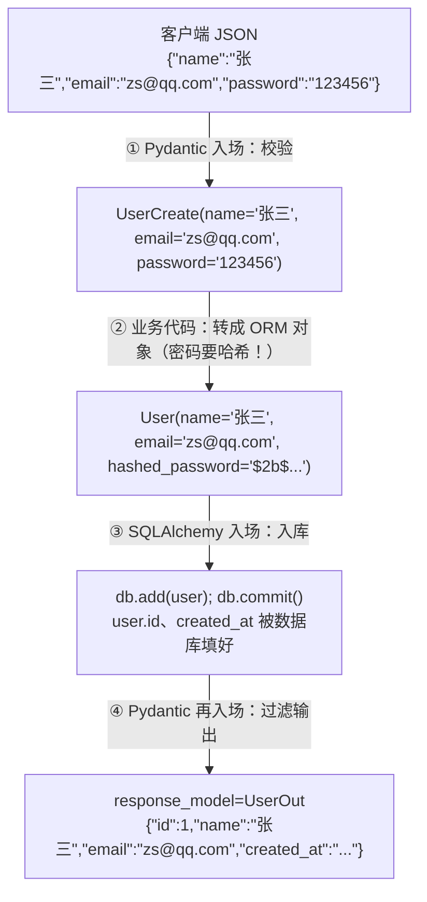

# 6.3 Pydantic 与 ORM 模型的配合

> 项目里会同时存在两套"模型"：SQLAlchemy 模型和 Pydantic 模型。新手最大的困惑就是"为什么要写两遍、各管什么、怎么互转"。本节彻底理清。

## 一、为什么需要两套模型？

| | SQLAlchemy 模型（ORM） | Pydantic 模型（Schema） |
|--|----------------------|------------------------|
| 职责 | 数据**怎么存**：表结构、关系、持久化 | 数据**怎么进出 API**：校验入参、定义出参 |
| 面向 | 数据库 | HTTP / JSON |
| 文件惯例 | `models.py` | `schemas.py` |

为什么不能一套通吃？看这个例子就懂了——同一个"用户"，不同场景需要的字段完全不同：

```
数据库里的 User：id, name, email, hashed_password, is_active, created_at
注册接口的入参：      name, email, password        ← 没有id（数据库生成）；是明文password
注册接口的出参：  id, name, email,        created_at  ← 绝不能返回密码！
更新接口的入参：      name?, email?                 ← 全部可选（改哪个传哪个）
```

**一张表，四种数据形状。** Pydantic 模型（业内叫 **Schema**）就是给每种形状一个明确定义。这不是重复劳动，而是 API 的安全边界：**客户端不能塞的字段进不来，不该暴露的字段出不去。**

## 二、Schema 的标准分层写法

以用户为例，`schemas.py` 的典型结构：

```python
# schemas.py
from datetime import datetime
from pydantic import BaseModel, ConfigDict, EmailStr, Field


# ---------- 公共基类：进出都有的字段 ----------
class UserBase(BaseModel):
    name: str = Field(min_length=1, max_length=50, description="用户名")
    email: EmailStr


# ---------- 入参：创建 ----------
class UserCreate(UserBase):
    password: str = Field(min_length=6, description="明文密码，服务端负责哈希")


# ---------- 入参：更新（全部可选） ----------
class UserUpdate(BaseModel):
    name: str | None = Field(default=None, min_length=1, max_length=50)
    email: EmailStr | None = None


# ---------- 出参 ----------
class UserOut(UserBase):
    model_config = ConfigDict(from_attributes=True)   # ← 关键配置，见下文

    id: int
    created_at: datetime
    # 注意：没有 password 相关字段 → 永远不可能泄漏
```

命名惯例：`XxxBase`（公共字段）→ `XxxCreate` / `XxxUpdate`（入参）→ `XxxOut`（出参）。继承减少重复。

## 三、关键配置：`from_attributes=True`

Pydantic 默认从**字典**构造模型。但 SQLAlchemy 查出来的是**对象**（属性访问）。`from_attributes=True` 就是打通这一层的开关：

```python
class UserOut(BaseModel):
    model_config = ConfigDict(from_attributes=True)
    id: int
    name: str
```

配上它之后，两件事成为可能：

```python
# ① 手动转换：ORM 对象 → Pydantic 对象
user_orm = session.get(User, 1)                      # SQLAlchemy 对象
user_out = UserOut.model_validate(user_orm)          # 读取同名属性完成转换
print(user_out.model_dump())                         # {'id': 1, 'name': '张三'}

# ② 自动转换（最常用）：接口配 response_model 后直接返回 ORM 对象
@app.get("/users/{user_id}", response_model=UserOut)
def get_user(user_id: int, db: DbSession):
    return db.get(User, user_id)     # 直接返回 ORM 对象，FastAPI 自动转成 UserOut → JSON
```

> 📌 老教程里的 `class Config: orm_mode = True` 是 Pydantic v1 写法，v2 改成了 `model_config = ConfigDict(from_attributes=True)`。看到 orm_mode 就知道那是老代码。

## 四、完整数据流：一个请求的旅程

以"注册用户"为例，看两套模型如何接力：



代码实现：

```python
@app.post("/users", response_model=UserOut, status_code=201)
def create_user(data: UserCreate, db: DbSession):
    user = User(
        name=data.name,
        email=data.email,
        hashed_password=fake_hash(data.password),   # 永远不存明文！
    )
    db.add(user)
    db.commit()
    return user     # ORM 对象 → response_model 自动转 UserOut
```

### 入参转 ORM 的简写技巧

字段多时逐个写太啰嗦，用 `model_dump()` 展开：

```python
# 字段名完全对应时：
user = User(**data.model_dump())

# 有差异字段时：排除掉再补
user = User(
    **data.model_dump(exclude={"password"}),
    hashed_password=fake_hash(data.password),
)
```

## 五、更新接口的标准姿势：exclude_unset

PATCH 语义——客户端传哪个字段就改哪个。`exclude_unset=True` 只导出**客户端实际传了的**字段：

```python
@app.patch("/users/{user_id}", response_model=UserOut)
def update_user(user_id: int, data: UserUpdate, db: DbSession):
    user = db.get(User, user_id)
    if user is None:
        raise HTTPException(404, "用户不存在")

    for key, value in data.model_dump(exclude_unset=True).items():
        setattr(user, key, value)

    db.commit()
    return user
```

> 💡 为什么不用 `exclude_none`？如果某字段业务上允许"清空为 null"，客户端显式传 `"nickname": null` 与"根本没传 nickname"是两种意图。`exclude_unset` 能区分，`exclude_none` 不能。

## 六、嵌套 Schema：返回带关系的数据

想返回"用户及其文章列表"？Schema 一样可以嵌套：

```python
class PostOut(BaseModel):
    model_config = ConfigDict(from_attributes=True)
    id: int
    title: str


class UserWithPosts(UserOut):
    posts: list[PostOut] = []       # 对应 ORM 的 user.posts 关系
```

```python
@app.get("/users/{user_id}/detail", response_model=UserWithPosts)
def get_user_detail(user_id: int, db: DbSession):
    stmt = select(User).options(selectinload(User.posts)).where(User.id == user_id)
    user = db.scalar(stmt)
    if user is None:
        raise HTTPException(404, "用户不存在")
    return user      # posts 关系自动逐个转成 PostOut
```

> ⚠️ 记得 `selectinload` 预加载！Pydantic 转换时会访问 `user.posts`——不预加载轻则触发 N+1，异步下直接报错（4.4 / 5.4 节的知识在这里闭环了）。

## 📝 本节小结

- 两套模型分工：SQLAlchemy 管存储，Pydantic（Schema）管 API 进出与安全边界
- 标准四件套：`XxxBase` / `XxxCreate` / `XxxUpdate` / `XxxOut`
- 出参 Schema 配 `model_config = ConfigDict(from_attributes=True)`，接口配 `response_model`，直接 return ORM 对象
- 入参转 ORM：`User(**data.model_dump())`；更新用 `model_dump(exclude_unset=True)`
- 嵌套 Schema 输出关系数据，务必配合 selectinload

万事俱备，组装完整接口 → [6.4 完整的 CRUD 接口](04-完整CRUD接口.md)
