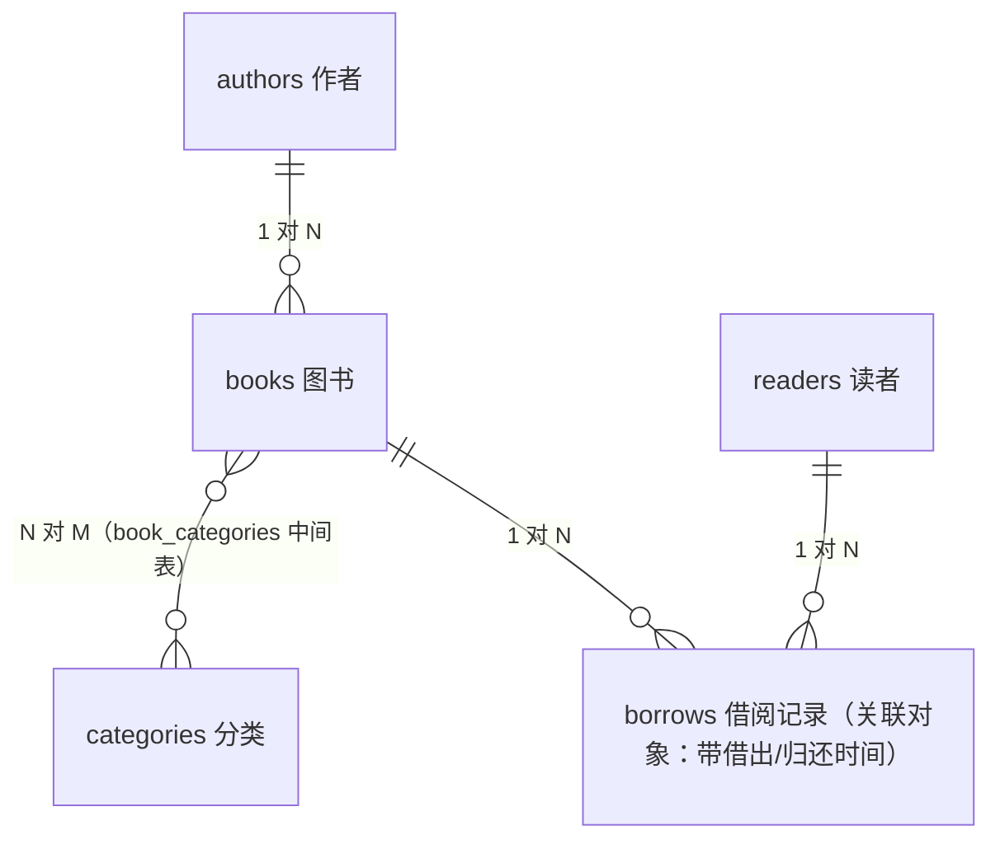

# 7.1 实战项目：图书管理系统 —— 介绍与结构设计

> 最后一战：从零构建一个"图书管理系统 API"。它覆盖本教程的全部核心知识点，规模刚好——不至于大到写不完，也不至于小到没含金量。做完它，你就有了第一个可以写进简历的后端项目。

## 一、需求分析

一个图书馆的后台 API，管理**图书、作者、分类、借阅**：

**功能清单：**

1. **作者管理**：录入作者（姓名、简介），查看作者及其全部作品
2. **分类管理**：图书分类（如"计算机"、"文学"），一本书可属于多个分类
3. **图书管理**：图书 CRUD、按书名搜索、按分类/作者筛选、分页
4. **借阅管理**：借书（检查库存）、还书、查询某本书的借阅记录、逾期查询

**这个需求为什么好？** 它天然覆盖了所有关系类型：

| 关系 | 体现 | 学过的章节 |
|------|------|-----------|
| 一对多 | 作者 → 图书 | 4.1 |
| 多对多 | 图书 ↔ 分类 | 4.3 |
| 关联对象（带字段的多对多） | 图书 ↔ 借阅人（借出/归还时间） | 4.3 第五部分 |
| 聚合统计 | 各分类藏书量、热门图书 | 5.1 |
| 事务 | 借书 = 减库存 + 记录借阅，必须同生共死 | 5.2 |

## 二、数据库设计（E-R 图）



**表结构设计：**

```
authors（作者）
  id, name, bio, created_at

categories（分类）
  id, name(unique)

books（图书）
  id, title(索引), isbn(unique), summary, total_copies(馆藏册数),
  available_copies(可借册数), author_id(外键→authors), created_at

book_categories（图书-分类中间表）
  book_id, category_id（联合主键）

readers（读者）
  id, name, email(unique), created_at

borrows（借阅记录）
  id, book_id(外键), reader_id(外键),
  borrowed_at(借出时间), due_date(应还日期), returned_at(归还时间, NULL=未还)
```

> 💡 设计要点解读：
> - `available_copies`（可借册数）是**冗余字段**——本可以通过"总数 - 未还记录数"算出来，但每次都算太慢，冗余存储换查询性能。代价是借/还书时必须在**同一事务**里维护它（5.2 节的用武之地）。
> - `returned_at` 为 NULL 表示"未归还"——用可空时间字段表达状态，比单独的布尔字段信息量更大。

## 三、项目结构：分层架构

第 6.4 节的四文件结构再进一步，按"层"组织代码——这是中小型 FastAPI 项目的主流结构：

```
library_api/
├── app/
│   ├── __init__.py
│   ├── database.py          # 引擎、SessionLocal、Base、get_db
│   ├── models.py            # 所有 SQLAlchemy 模型
│   ├── schemas.py           # 所有 Pydantic Schema
│   ├── crud.py              # 数据访问层：封装所有数据库操作
│   ├── routers/             # 路由层：按资源拆分
│   │   ├── __init__.py
│   │   ├── authors.py
│   │   ├── books.py
│   │   └── borrows.py
│   └── main.py              # 应用入口：组装所有 router
├── tests/
│   └── test_api.py          # 接口测试
└── requirements.txt
```

### 各层职责（重要！）

```
请求 → routers（路由层） → crud（数据层） → models（模型） → 数据库
              │                  │
        管：HTTP 相关         管：数据库相关
        - 参数解析/校验       - 构建查询语句
        - 状态码/错误响应     - 增删改操作
        - 调用 crud          - 不关心 HTTP！
```

**为什么要多一层 crud.py？** 好处立竿见影：

1. **复用**："按 id 查书，查不到返回 None" 这种逻辑，详情/更新/删除/借书四个接口都要用，写一次
2. **可测试**：数据层函数不依赖 HTTP，可以单独测试
3. **可替换**：将来加缓存、换数据库、改用异步，只动 crud 层

> 📌 大型项目还会再加一层 service（业务逻辑层）放复杂业务规则。我们的规模两层足够——"借书"这种带业务规则的逻辑，放在 crud 里稍作标注即可。

## 四、接口设计（API 契约）

先定契约再写代码，是后端开发的好习惯：

```
作者
  POST   /authors                创建作者
  GET    /authors                作者列表
  GET    /authors/{id}           作者详情（含全部作品）

分类
  POST   /categories             创建分类
  GET    /categories             分类列表（含各分类藏书量）

图书
  POST   /books                  录入图书（可同时指定分类）
  GET    /books                  图书列表：分页 + 书名搜索 + 按分类/作者筛选
  GET    /books/{id}             图书详情（含作者、分类、库存）
  PATCH  /books/{id}             更新图书信息
  DELETE /books/{id}             下架图书

读者与借阅
  POST   /readers                注册读者
  POST   /borrows                借书 {book_id, reader_id, days}
  POST   /borrows/{id}/return    还书
  GET    /borrows                借阅记录：可筛选"未还"/"逾期"
  GET    /books/{id}/borrows     某本书的借阅历史
```

状态码约定沿用 6.1 节：201 创建 / 404 不存在 / 409 冲突（ISBN 重复、无库存可借、重复还书）。

## 五、动手准备

```bash
mkdir library_api && cd library_api
mkdir -p app/routers tests
# Windows PowerShell: mkdir app\routers, tests

# 创建空的 __init__.py（标记为 Python 包）
# app/__init__.py 和 app/routers/__init__.py 都建一个空文件
```

依赖沿用 1.2 节装好的环境（sqlalchemy + fastapi[standard]）。

## 📝 本节小结

- 项目：图书管理 API，覆盖一对多、多对多、关联对象、聚合、事务全部知识点
- 数据库 6 张表；`available_copies` 冗余设计 + 事务维护是本项目的技术亮点
- 分层结构：**routers 管 HTTP，crud 管数据库**，职责分明
- 先定 API 契约，再动手写代码

下一节写数据层 → [7.2 数据层实现：模型与 CRUD](02-数据层实现.md)
